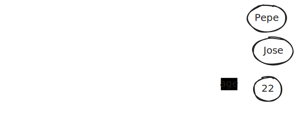

# 1.Introducción

- Introducción a Javascript
- Trabajando con HTML
- Fundamentos Javascript (1) - Valores, variables y tipos
- Trabajando con números
- Trabajando con cadenas de caracteres
- Objetos básicos
- Fundamentos Javascript (2) - Operadores y expresiones
- Trabajando con funciones
- Trabajando con Arrays
- Trabajando con JSON

## Índice

- [1.Introducción](#1introducción)
  - [Índice](#índice)
  - [Lenguajes en la Web](#lenguajes-en-la-web)
    - [HTML y CSS](#html-y-css)
    - [JavaScript (JS, ECMAScript, ES)](#javascript-js-ecmascript-es)
      - [Evolución](#evolución)
  - [JS / ES](#js--es)
    - [Estructura básica del lenguaje](#estructura-básica-del-lenguaje)
      - [Sintaxis del código. Comentarios](#sintaxis-del-código-comentarios)
      - [Sentencias (statements)](#sentencias-statements)
      - [Palabras reservadas](#palabras-reservadas)
      - [Modo estricto](#modo-estricto)
    - [Identificadores](#identificadores)
    - [Naming conventions](#naming-conventions)
      - [Naming selection](#naming-selection)
  - [Evolución del Estándar ECMAScript (ES)](#evolución-del-estándar-ecmascript-es)
    - [ES5 (ES2009)](#es5-es2009)
    - [ES6 (ES2015)](#es6-es2015)
    - [ES2016](#es2016)
    - [ES2017](#es2017)
    - [ES2018](#es2018)
    - [ES2019](#es2019)
    - [ES2020](#es2020)
    - [ES2021](#es2021)
    - [ES2022](#es2022)
    - [ES2023](#es2023)
    - [ES2024](#es2024)
  - [Entornos JS](#entornos-js)
    - [Instalaciones](#instalaciones)
    - [JS en Web (HTML files)](#js-en-web-html-files)
    - [JS en el navegador (consola)](#js-en-el-navegador-consola)
    - [Node](#node)
    - [Entrada y salda en el navegador](#entrada-y-salda-en-el-navegador)
  - [Valores, variables y tipos](#valores-variables-y-tipos)
    - [Valores o datos. Tipos primitivos v referenciados](#valores-o-datos-tipos-primitivos-v-referenciados)
      - [Tipos primitivos](#tipos-primitivos)
      - [Tipos referenciados](#tipos-referenciados)
      - [Modelo mental de JS. Datos](#modelo-mental-de-js-datos)
    - [Variables](#variables)
      - [Declaración y asignación de variables](#declaración-y-asignación-de-variables)
      - [Modelo mental de JS. Variables](#modelo-mental-de-js-variables)
      - [let y const](#let-y-const)
      - [Magic numbers](#magic-numbers)
      - [Expresiones](#expresiones)
    - [Tipos de las variables](#tipos-de-las-variables)
      - [Variables de Tipos primitivos](#variables-de-tipos-primitivos)
        - [Tipo string](#tipo-string)
        - [Tipo number](#tipo-number)
        - [Tipo boolean](#tipo-boolean)
      - [Casting o coercion](#casting-o-coercion)
        - [Reglas de conversión](#reglas-de-conversión)
  - [Funciones y objetos. Primera aproximación](#funciones-y-objetos-primera-aproximación)
    - [Funciones](#funciones)
    - [Objetos](#objetos)
      - [Representación de los objetos en el modelo mental](#representación-de-los-objetos-en-el-modelo-mental)
      - [Mutabilidad de los objetos](#mutabilidad-de-los-objetos)
      - [let y const con los objetos](#let-y-const-con-los-objetos)
  - [Igualdad en JS](#igualdad-en-js)
    - [Identidad (Object.is())](#identidad-objectis)
    - [Igualdad estricta (===)](#igualdad-estricta-)
    - [Igualdad débil (==)](#igualdad-débil-)

## Lenguajes en la Web

Son tres los lenguajes que dan soporte a la Web y se encuentran **estandarizados** por entidades internacionales, para favorecer que puedan ser utilizados por todos los programas **clientes** de la Web, principalmente navegadores, pero también otros como los lectores de pantalla.

- HTML, estandarizado por W3C y WhatWG
- CSS, estandarizado por W3C y WhatWG
- JavaScript, estandarizado por ECMA y conocido oficialmente como ECMAScript (ES)

### HTML y CSS

Construyen la parte menos 'dinámica' de la Web

HTML es un lenguaje de marcas que describe la estructura y la semántica de un documento
Especialmente en el contexto de los componentes Web, puede considerarse un lenguaje de programación declarativo

CSS es un lenguaje de definición de estilos.
En su evolución actual también puede considerarse un lenguaje de programación declarativo o imperativo

### JavaScript (JS, ECMAScript, ES)

Es un lenguaje de programación en el sentido tradicional, aunque realmente combina elementos de los paradigmas declarativo e imperativo, por lo que puede ser usado, en cierta medida para la programación funcional.

Es un lenguaje interpretado, pensado inicialmente para realizar scripts que proporcionaran dinamismo en los clientes Web, e.g. en la validación de formularios.

Fue creado en 1995 por [**Brendan Eich**](https://es.wikipedia.org/wiki/Brendan_Eich), trabajando para NetScape en la época en que fue absorbida por Sun Microsystems (hoy Oracle). Sin embargo, la política de Netscape respecto a la propiedad del código llevo a que liberara tanto su emblemático navegador (que dío lugar a Mozilla) como el lenguaje de scripts.

A partir de 1997, **ECMA (European Computer Manufacturer’s Association)**, por medio del [**tc39**](https://tc39.es/), se hace cargo del lenguaje y publica el primer estándar refiriéndose a el como ECMAScript, al haber quedado el nombre de JS en manos de Sun Microsystems.

Desde entonces las funcionalidades del lenguaje han crecido constantemente, haciéndolo uno de los más utilizados actualmente.

#### Evolución

- [1998]. [**Alex Hopmann**](<https://en.wikipedia.org/wiki/Ajax_(programming)>) incorpora en Outlook Web Access (OWA) para Microsoft Exchange 2000 el objeto **XMLHttpRequest**, base de las tecnologías que se conocerán como **AJAX**.
- [2004]. **GMail** utiliza JS, incorporándole AJAX masivamente, para implementar su cliente de correo en el navegador de primera clase
- [2006]. [**John Resig**](https://en.wikipedia.org/wiki/John_Resig) crea **JQuery**, la biblioteca que terminará por ser un estándar "de facto"
- [2009]. JS se incorpora al backend (lado servidor) con la aparición de **Node.js**, de la mano de [**Ryan Dahl**](https://en.wikipedia.org/wiki/Ryan_Dahl)
- [2009]. Se aprueba **ECMAScript 5**, el estándar soportado por los navegadores durante años.
- [2010]. [**Miško Hevery**](<https://es.wikipedia.org/wiki/Angular_(framework)>) presenta la primera versión de **AngularJS**, el framework que, con el apoyo de Google, llevara las Single Page Applications a convertirse en uo de los elementos claves del desarrollo Web
- [2012]. JS incorpora al escritorio del cliente, al ser uno de los lenguajes nativos en Windows 8
- [2013]. [**Jordan Walke**](https://es.wikipedia.org/wiki/React) de Facebook, presenta **React.JS**, la primera alternativa seria a Angular
- [2015]. A partir del Flux, [**Dan Abramov**](<https://es.wikipedia.org/wiki/Redux_(JavaScript)>) desarrolla la idea de **Redux**, la biblioteca que se convertirá en el estándar para la gestión de estados en aplicaciones React y en otros frameworks
- [2015]. Se aprueba **ECMAScript 6** o **ES2015**, el estándar que actualiza el lenguaje de forma destacada, introduciendo el compromiso de una versión nueva cada año (ES20xx), con más o menos actualizaciones.
- [2016]. [**Evan You**](https://es.wikipedia.org/wiki/Vue.js) presenta **Vue.js**, la alternativa a Angular y React que se convertirá en la más popular en China

## JS / ES

Como hemos visto, **JavaScript** (JS) o **ECMAScript** (ES) es un lenguaje de programación imperativo e interpretado, que inicialmente se ejecutaba en el **cliente**, en el navegador, y que permite realizar operaciones de forma dinámica, sin necesidad de recargar la página. Posteriormente se ha extendido al **servidor**, con Node.js, y al escritorio, con aplicaciones de escritorio.

### Estructura básica del lenguaje

Similar a la de muchos otros **lenguajes imperativos** (C, Java, Php, Python, etc.), aunque con algunas particularidades que lo hacen único.

Se suceden una serie de **instrucciones** o **sentencias** que se ejecutan secuencialmente, pero que pueden ser interrumpidas por instrucciones de control de flujo, como las condicionales o los bucles.

En general, las instrucciones se separan por **punto y coma**, aunque no es necesario si se separan por saltos de línea. En la práctica configuraremos nuestro editor para que añada los puntos y comas automáticamente.

En esta instrucciones se accede a **datos** de diferentes tipos, que pueden ser almacenados en **variables**, que se declaran con las palabras reservadas `cont` y `let`. Con estas variables y **operadores** de diversos tipos se construyen las **expresiones** que permiten llevar a cabo una determinada lógica, conocida como **algoritmo**.

```js
let price = 1;
let amount = 2;
let totalWithIva = price * 1.22 * amount;
```

Las sentencias se agrupan en **bloques** de código llamados **funciones**, que se delimitan por llaves `{}` y que reciben un nombre para poder ser **invocados** en el momento que sea necesario

Típicamente una función

- recibe datos
- hace operaciones con ellos
- si es necesario devuelve un resultado (nuevamente un dato)

```js
function addIVA(a) {
  return a * 1.22;
}

const precioConIVA = addIVA(100);
console.log(precioConIVA);
```

#### Sintaxis del código. Comentarios

**Sensible al caso** (distingue las mayúsculas y minúsculas), e.g. en los nombres de variables, funciones y operadores

A lo largo del código pueden aparecer **comentarios**, que son texto que no se ejecuta, y que sirven para documentar el código, facilitando su comprensión y mantenimiento.

```js
// Esto es un comentario de una sola línea
/*
  Esto es un comentario de varias líneas
  que se extiende
  tanto como sea necesario
*/
```

#### Sentencias (statements)

**Sentencia**: cada instrucción o conjunto de instrucciones que se ejecuta de una vez.
Muchas veces equivale a una 'linea' de código.

No es necesario terminar cada sentencia con el carácter de **punto y coma**.
Si una sentencia comienza con (, el uso del ; se vuelve obligatorio

En todo caso es habitual y recomendable **terminar cada sentencia con punto y coma**: si instalamos Prettier (e.g. como plugin de VSC) lo hará por nosotros.

```js
const user = 'Pepe';
console.log('Hola ' + user);
```

#### Palabras reservadas

`abstract`
`boolean` `break` `byte`
`case` `catch` `char` `class` `const` `continue`
`debugger` `default` `delete` `do` `double`
`else` `enum` `export` `extends`
`false` `final` `finally` `float` `for` `function`
`goto`
`if` `implements` `import` `in` `instanceof` `int` `interface`
`long`
`native` `new` `null`
`package` `private` `protected` `public`
`return`
`short` `static` `super` `switch` `synchronized`
`this` `throw` `throws` `transient` `true` `try` `typeof`
`var` `volatile` `void`
`while` `with`

No lo son, sorprendentemente `undefined`, `NaN`, `Infinity`

#### Modo estricto

El modo estricto se activa con la sentencia `'use strict'` al principio del código o de una función.

```js
'use strict';
```

También se activa implícitamente en los módulos de ES6, que veremos más adelante.
El uso de ESM (ECMAScript Modules) se activa con la extensión `.mjs` en lugar de `.js` o con la propiedad `"type": "module"` en el `package.json`.

En este modo se aplican reglas más estrictas al código, lo que facilita la detección de errores y la escritura de código más seguro.
Por ejemplo

- no se permiten variables sin declarar
- no es posible la re-asignación de variables declaradas con `const`.
- no se pueden tratar como objetos los valores primitivos

### Identificadores

Son los nombres de las variables, contantes, funciones...
Sólo puede estar formado por

- Letras
- Números
- el signo $ (dólar)
- el signo \_ (guion bajo).

Los dos últimos solo se usan en algunos casos concretos

El primer carácter no puede ser un número.

### Naming conventions

Es importante seguir una convención de nombres para los identificadores (las variables, funciones y constantes) que se utilizan en el código, para facilitar su lectura y mantenimiento.

Algunas de las convenciones más comunes en diversos lenguajes son:

- **camelCase**: `nombreDeLaVariable`
- **PascalCase**: `NombreDeLaFunción`
- **snake_case**: `nombre_de_la_variable`
- **kebab-case**: `nombre-de-la-variable`
- **UPPERCASE**: `NOMBRE_DE_LA_CONSTANTE`

En JS Los identificadores se escriben en **camelCase**, tanto para las variables como para las funciones.

Para las clases, funciones constructoras y algunos casos particulares de algún framework (como componentes de React) se utiliza **PascalCase**. Las constantes en sentido estricto (valores primitivos invariables) como son las constantes globales o de configuración pueden seguir nombrándose en **UPPERCASE** , como se hacia tradicionalmente.

#### Naming selection

Hace referencia a las buenas practicas en la elección de los identificadores de las variables

- las palabras reservadas no pueden ser usadas como identificadores
- siempre en inglés
- sin abreviaturas, a no ser que sean de uso universal o muy generalizado (Id, km, FAQ, PhD, CEO ...)
  - también se abrevia los indices de los bucles (i, j, k)
- evitar usar números en los nombres de las variables (salvo en casos muy concretos)
  - ea imposible en el primer carácter del identificador
- no usar nombres genéricos (data, info, value, item, obj, ...)
- deben ser auto-explicativas, describiendo lo que almacenan con un valor semántico lo más completo posible
- lo más cortas que admita la regla anterior
- siempre en positivo por ejemplo, en lugar de `noData` usar `data` o `hasData`
- para valores booleanos, es recomendable que empiecen por 'is' o 'has'
- para las funciones, es recomendable incluir un verbo relativo a la acción que representan
- para los objetos, es recomendable que empiecen por un sustantivo que describa el objeto que representan
- para los arrays, es recomendable que empiecen por un sustantivo en plural que describa los elementos que almacenan
  - una alternativa cuestionable es que terminen por 'List' o 'Array'

## Evolución del Estándar ECMAScript (ES)

### ES5 (ES2009)

- Use of “use strict mode“.
- Use of array methods like Array.**isArray()**, Array.prototype.**forEach()**, Array.prototype.**map()**, Array.prototype.**filter()**, Array.prototype.**reduce()**, Array.prototype.**some()**, Array.prototype.**every()** etc.
- Use of Trailing Commas & Multiline strings.
- JSON methods like JSON.**stringify()**, JSON.**parse()**.
- Object Methods such as Object.**defineProperty()**, Object.**create()**, Object.**keys()** etc.
- Property names using reserved words.

<https://usemynotes.com/difference-between-es5-and-es2015/>

### ES6 (ES2015)

- Arrow functions
- Defining variables using let & const keywords along with var keyword.
- Use of Destructing. Rest & Spread Operators in arrays.
- Objects, Classes & Inheritance.
- Use of string methods like String.prototype.**includes()**, String.prototype.**endsWith()**, String.prototype.**startWith()**.
- New primitive data type, Symbol for defining unique values.
- Use of JavaScript Modules (ESM)
- For/of loop
- Template Literals o Template Strings
- Promises

<https://usemynotes.com/difference-between-es5-and-es2015/>

### ES2016

- Array.prototype.**includes**
- Exponentiation Operator (\*\*)

[The ES2016 Guide](https://flaviocopes.com/es2016/)

[ES2016, el nuevo estándar JS](http://blog.enriqueoriol.com/2016/11/es2016.html)

### ES2017

- Async functions (async/await)
- String padding (String.prototype.**padStart**, String.prototype.**padEnd**)
- Object.**values()**, **Object.entries()**
- Object.**getOwnPropertyDescriptors()**
- Trailing commas in function parameter lists and calls
- Shared memory and atomics (web workers)

[The ES2017 Guide](https://flaviocopes.com/es2017/)

[Qué hay de nuevo en ES2017 (aka ES8)](https://medium.com/@FlavioCorpa/qu%C3%A9-hay-de-nuevo-en-es2017-aka-es8-6653472c89a9)

### ES2018

- Rest/Spread Properties in objects
- Asynchronous iteration (for-await-of)
- Promise.prototype.**finally()**
- Regular Expression improvements
  - RegExp lookbehind assertions: match a string depending on what precedes it
  - Unicode property escapes \p{…} and \P{…}
  - Named capturing groups
  - The s flag for regular expressions

[The ES2018 Guide](https://flaviocopes.com/es2018/)

[Qué hay de nuevo en ES2018 (aka ES9)](https://medium.com/@FlavioCorpa/qu%C3%A9-hay-de-nuevo-en-es2018-aka-es9-c8bd04ae00b1)

### ES2019

- Array.prototype.{**flat**,**flatMap**}
- Optional catch binding (catch without parameters)
- Object.**fromEntries()**
- String.prototype.{**trimStart**,**trimEnd**}
- Symbol.prototype.description
- JSON improvements
- Well-formed JSON.stringify()
- Function.prototype.**toString()**

[The ES2019 Guide](https://flaviocopes.com/es2019/)

[Qué hay de nuevo en ES2019 (ES10)](https://medium.com/@FlavioCorpa/qu%C3%A9-hay-de-nuevo-en-es2019-es10-6e22a3785b7e)

### ES2020

- BigInt
- dynamic import: import()
- import.meta
- nullish coalescing (??)
- optional chaining (?.)
- Promise.**allSettled**
- String.prototype.**matchAll**
- globalThis
- export \* as ns from
- for-in enhancements (enumeration order)

[ES2020 Features!](https://h3manth.com/ES2020/)

### ES2021

- String.prototype.**replaceAll**
- Promise.**any** & AggregateError
- Numeric Separators (1_000)
- Logical Assignment Operators (&&= ||= ??=)
- WeakRefs & FinalizationRegistry Objects

[ES2021 Features!](https://h3manth.com/ES2021/)

### ES2022

- .at() method on built-in indexables (Array.prototype.**at**, String.prototype.**at**)
- Object.**hasOwn**
- Error cause
- Top-level await
- Class field declarations
- Ergonomic brand checks for private fields (#field)
- RegExp Match Indices

[ES2022 Features!](https://h3manth.com/ES2022/)

### ES2023

- Array find from last (Array.prototype.**findLast**, Array.prototype.**findLastIndex**)
- Change array by copy (Array.prototype.**toSorted**, Array.prototype.**toReversed**, Array.prototype.**toSpliced**, Array.prototype.**with**)
- Hashbang Grammar (#! indicates a comment that can contain any text)
- Symbols as WeakMap keys

[ES2023 Features!](https://h3manth.com/ES2023/)

### ES2024

- Object.groupBy() & Map.groupBy()
- Temporal: new object proposal for working with dates and times
  Temporal.PlainDate(), Temporal.PlainTime(), Temporal.PlainMonthDay(), Temporal.PlainYearMonth()

[ES2024 Features!](https://h3manth.com/ES2024/)

## Entornos JS

### Instalaciones

- VSC
- Node
- Chrome - ver Herramientas del navegador

### JS en Web (HTML files)

- in line

```html
<p onclick="alert('Un mensaje de prueba')">párrafo</p>
```

- script

```html
<script>
  // Código JavaScript
</script>
```

- js files

```html
<script src="sample.js"></script>
```

```js
// file sample.js
// Código JavaScript
```

Posición en el documento HTML

- al final del head (preferible)

```html
<script src="sample.js" defer></script>
```

- al final del body

### JS en el navegador (consola)

- consola -> herramientas de desarrollo en el navegador

```js
let x = 22; // enter
x; // enter
```

### Node

- instalación

[https://nodejs.org/es](https://nodejs.org/es)

- linea de comandos

```shell
node -v
node sample.js
```

### Entrada y salda en el navegador

funciones (métodos) del Web API [Window](https://developer.mozilla.org/en-US/docs/Web/API/Window)

- Salida de datos

```js
alert(' Hola Mundo ');
confirm('Escribe tu nombre');
```

- Entrada de datos

```js
prompt('Escribe tu nombre');
```

## Valores, variables y tipos

### Valores o datos. Tipos primitivos v referenciados

Son los datos con los que trabajan los programas o las partes de ellos que conocemos como funciones. Los valores pueden ser de varios tipos que se agrupan en dos grandes categorías

- **tipos primitivos**
- **tipos referenciados**

#### Tipos primitivos

- simples elementos "atómicos" de información
- se manipulan "por valor"
- son inmutables

1. undefined
2. null (por error, typeof lo refiere como 'object')
3. number
4. string
5. boolean
6. bigint [_🗓️ES2020_]
7. symbol [_🗓️ES2015_]

#### Tipos referenciados

- objetos formados por múltiples elementos de información
- se manipulan por referencia
- son mutables: sus propiedades cambian de forma dinámica

8. object

Las funciones son también object, aunque typeof las refiere como function

```js
console.log(undefined, typeof undefined); // undefined undefined
console.log(12, typeof 12); // 12 number
console.log('pepe', typeof 'pepe'); // pepe string
console.log(true, typeof true); // true boolean
console.log(null, typeof null, 'mentira, es null'); // null object mentira, es null
console.log(0n, typeof 0n); // 0n bigint
console.log(Symbol(''), typeof Symbol('')); // Symbol() symbol
console.log({}, typeof {}); // {} object
console.log(() => {}, typeof (() => {}), 'también es object');
// [Function (anonymous)] function también es object
```

Nos ocuparemos de ellos algo más adelante

#### Modelo mental de JS. Datos

Para entender cómo se manejan los datos en JS, **Dan Abramov**, uno de los creadores de Redux, propone un **modelo mental** basado en diversas analogías

- el código es un planeta en el centro del sistema
- los objetos y las funciones son **creados** (instanciados) desde el código y orbitan alrededor de él
  Al ser creados, estos elementos pueden modificarse (son **mutables**) y pueden ser eliminados
- los datos primitivos forman un firmamento **inmutable** que rodea al código, más allá de los objetos y funciones
  El código no puede crear, ni modificar ni eliminar estos datos, lo único que puede hacer es **referenciarlos** o dejar de hacerlo


### Variables

#### Declaración y asignación de variables

Las variables son **identificadores** (nombres) asociados a un determinado **valor**

```js
let foo;
```

Declara la variable y le asigna implícitamente el valor undefined

Equivale a

```js
let foo = undefined;
```

La declaración suele incluir la asignación de un valor distinto de undefined
Para ello se utiliza el **operador de asignación**: el signo =

```js
let x = 22;
const user = 'Pepe';
```

En **modo estricto** ('use strict' o 'module') intentar usar **variables sin declararlas** da un error **ReferenceError**

#### Modelo mental de JS. Variables

Con respecto a las variables, el **modelo mental** propuesto por **Abramov** huye de la habitual analogía de las **cajas** y las **etiquetas** (que se pegan a las cajas), para proponer
la analogía de los **alambres** con sus **etiquetas**, que se conectan a los datos o valores


El modelo sigue ciertas reglas que se ajustan con precisión al funcionamiento real de JS

- los **alambres** (variables) siempre están conectados a un **dato** (valor)
- nunca se conectan a otros **alambres** o a sus etiquetas
- los datos primitivos no pueden nunca conectarse a otros datos (dejarían de ser atómicos o primitivos)
- los objetos y las funciones pueden tener propiedades, que son alambres que representaremos incluyendo su nombre
- estos alambres estarán siempre conectados datos (primitivos o no) como sucede con las variables

#### let y const

Existen 2 palabras reservadas responsables de la declaración de variables [_🗓️ES2015_]

- **let** -> se puede reasignar más adelante
- **const** -> NO se puede reasignar posteriormente

```js
let x = 22;
const user = 'Pepe';
x = 34;
// user = 'Juan' daría un error
```


Tanto let como const dan lugar a variables cuyo ámbito (scope) es el bloque en el que se declaran

```js
{
  let x = 22;
  const user = 'Pepe';
}
console.log(x); // ReferenceError
console.log(user); // ReferenceError
```

Originalmente JS solo disponía de la palabra reservada **var** para declarar variables, que tiene un ámbito más amplio, el de la función en la que se declara
Aunque sigue siendo válida, es poco habitual usarla, ya que let y const son más seguras y fáciles de usar

La mejor práctica es usar **const** siempre que sea posible, y **let** solo cuando sea necesario reasignar el valor de la variable.

#### Magic numbers

Los **números mágicos** son valores literales que aparecen en el código sin una explicación clara de su significado.

```js
let price = 22;
let total = price * 1.22;
```

Es recomendable evitar los números mágicos, sustituyéndolos por **constantes** que expliquen su significado

```js
const IVA = 1.22;
let price = 22;
let total = price * IVA;
```

Para este caso de contantes, es buena práctica usar **UPPERCASE** para diferenciarlas de las variables

#### Expresiones

Lo que aparece a la **derecha** de la asignación es una **expresión**.
Las expresiones se evalúan a un **único valor**.
Dicho valor es asignado a la **variable** que aparece a la **izquierda** del operador.

```js
let x = 22; // Expresión literal: vale 'literalmente' lo que dice
x = 20 + 5; // Expresión aritmética
let z = x * 2; // Expresión aritmética que incluye una variable
// Usando el valor de la variable,
// se evalúa al valor resultante (50)
let foo = x === z; // Expresión lógica
// se evalúa al boolean true o false (en este caso, false)
```

### Tipos de las variables

El tipado de las variables en JS es

- débil: el tipo no se declara explícitamente, sino que se infiere del valor
- dinámico: el tipo de una variable puede cambiar, según cambia el valor

Por tanto los posibles tipos de las variables son los que ya vimos al hablar de los datos

```js
let foo;
console.log(foo, typeof foo);
foo = 12;
console.log(foo, typeof foo);
foo = 'pepe';
console.log(foo, typeof foo);
foo = true;
console.log(foo, typeof foo);
foo = undefined;
console.log(foo, typeof foo);
foo = null;
console.log(foo, typeof foo, 'mentira, es null');
foo = 0n;
console.log(foo, typeof foo);
foo = Symbol('');
console.log(foo, typeof foo);
foo = {};
console.log(foo, typeof foo);
foo = () => {};
console.log(foo, typeof foo, 'también es object');
```

#### Variables de Tipos primitivos

1. undefined
2. null (por error, typeof lo refiere como 'object')
3. number
4. string
5. boolean
6. bigint [_🗓️ES2020_]
7. symbol [_🗓️ES2015_]

##### Tipo string

```js
let cadena1 = 'Una cadena de caracteres';
let cadena2 = 'Otra cadena de caracteres';
```

Las **dobles comillas** ("") son válidas, pero la configuración de Prettier las sustituye por simples comillas ('')

En ES6 aparece la posibilidad de utilizar las comillas francesas (``) para crear un **template string** o **template literals** [_🗓️ES2015_]

```js
let user = 'Pepe';
let cadena3 = `Saludos ${user}`;
```

En los template strings es posible incluir expresiones, mediante ${}, para que sean evaluadas como parte de la expresión literal

##### Tipo number

Los números se forman con dígitos del 0 al 9 y el punto de los decimales.
Además, desde [_🗓️ES2021_], puede usarse el guion bajo (\_) como separador de miles

```js
const n1 = 1_000_000;
const n2 = 10.65;
```

Números válidos

```js
console.log(Number.MAX_VALUE); // 1.7976931348623157e308;
console.log(Number.MIN_VALUE); // 5e-324
```

Para valores mas grandes / pequeños existen los números Infinity

```js
console.log(Number.MAX_VALUE * 2); // Infinity
console.log(-Number.MAX_VALUE * 2); // -Infinity
```

Números en los que la precisión es correcta

```js
console.log(Number.MAX_SAFE_INTEGER); // 9_007_199_254_740_991
console.log(Number.MIN_SAFE_INTEGER); // -9_007_199_254_740_991
console.log(9_007_199_254_740_991 + 2); // 9_007_199_254_740_992 : Imprecision
```

La solución a este problema es el uso de un nuevo tipo, los bigint

```js
console.log(9_007_199_254_740_991n + 2n); // 9_007_199_254_740_993n;
```

Los números **`NaN`** representan las indeterminaciones matemáticas

```js
console.log(1 / 0); // Infinity
console.log(0 / 2); // 0
console.log(0 / 0); // NaN

console.log(Number('pepe')); // NaN
```

Las funciones isNaN ayudan a detectar estos valores.

En un caso realizan un casting a number; en el otro no

```js
console.log('Con casting', n, isNaN(n)); // true
console.log('Sin casting', n, Number.isNaN(n)); // false
```

##### Tipo boolean

Dos valores posibles: `true` y `false`

Cualquier valor de cualquier tipo puede hacer casting a boolean si se incluye en una expresión de tipo lógico.
Los valores pueden ser **falsy** o **truly** según se convierten a false o a true

Los **Valores falsy** son

false, 0, -0, 0n, '', NaN, undefined, null

#### Casting o coercion

La conversión de tipos (Type Conversion) puede ser implícita o explicita.

- **Conversión implícita**: se desencadena automáticamente durante la ejecución del código, como consecuencia de los requerimientos de las expresiones. Habitualmente denominada **coerción** (**coercion**)

Por ejemplo una operación de resta, multiplicación o división fuerza la conversión a number de las variables al evaluar la expresión. En ningún caso se cambia realmente el tipo de las variables

```js
const a = 12;
const b = '2';

console.log('a - b', a - b); // 10
console.log('a * b', a * b); // 24
console.log('a / b', a / b); // 6
console.log(typeof b); // string
```

Si la operación es una suma (+) la coerción es a string, porque el operador de concatenación tiene preferencia sobre el de suma

```js
console.log('a + b', a + b); // '122'
```

- **Conversión explicita** (responde a instrucciones incorporadas por el desarrollador para desencadenar la conversión) también llamada **type casting**

Por ejemplo se puede forzar que la operación entre strings y numbers dea una suma en lugar de una concatenación

```js
console.log('a + b', a + Number(b)); // 14
console.log('a + b', a + +b); // 14
console.log('a + b', a + parseInt(b)); // 14
```

En general, el casting explícito puede lograrse

- con las funciones 'constructoras' de los tipos primitivos: Number(), String() y Boolean().

```js
const s = '22';
console.log(s, typeof s, Number(s), typeof Number(s));
// 22 string 22 number
const num = 33;
console.log(num, typeof num, String(num), typeof String(num));
// 33 number 33 string
console.log(num, typeof num, Boolean(num), typeof Boolean(num));
// 33 number true boolean
```

- con algunos operadores o funciones: +, !!, parseInt()

```js
console.log(num, typeof num, !!num, typeof !!num);
// 33 number true boolean
```

- con los métodos específicos de algunos tipos: toString() disponible en numbers, booleans, objects

```js
const number = 22;
const boolean = true;
const object = { name: 'Pepe' };

console.log(number.toString()); // 22
console.log(boolean.toString()); // true
console.log(object.toString()); // [object Object]
```

##### Reglas de conversión

- to String

```js
console.log(22, String(22)); // 22
console.log(true, String(true)); // true
```

- to Number: NaN

```js
console.log('22', Number('22')); // 22
console.log('any', Number('any')); // NaN
console.log(undefined, Number(undefined)); // NaN
console.log(true, Number(true)); // 1
console.log(false, Number(false)); // 0
console.log('', Number('')); // 0
console.log(null, Number(null)); // 0
```

- to Boolean:
  - valores `falsy` (`false`, `0`, `-0`, `0n`, `NaN`, `''`, `undefined` y `null`) se convierten a false
  - valores `truly` (todos los demás) se convierten a true

## Funciones y objetos. Primera aproximación

### Funciones

Como sabemos, las sentencias se agrupan en **bloques** de código llamados **funciones**, que se delimitan por llaves `{}` y que reciben un nombre para poder ser **invocados** en el momento que sea necesario

Típicamente una función

- recibe datos
- hace operaciones con ellos
- si es necesario devuelve un resultado (nuevamente un dato)

```js
function addIVA(a) {
  return a * 1.22;
}

const precioConIVA = addIVA(100);
console.log(precioConIVA);
```

Una de las particularidades de JS es que las funciones son **objetos** de **primer orden** en JS, lo que significa que pueden ser tratadas como cualquier otro objeto.

Las funciones son también **object**, aunque typeof las refiere como **function**

```js
console.log(() => {}, typeof (() => {}), 'también es object');
// [Function (anonymous)] function también es object
```

### Objetos

Los objetos son colecciones de **propiedades**, que a su vez son pares clave-valor

- la clave es un **string** (o un symbol) que identifica la propiedad, y que tiene que ser única dentro del objeto
- el valor puede ser cualquier tipo de dato, incluido otro objeto y una función. En este último caso la propiedad se denomina **método**

La referencia a las propiedades de los objetos puede ser

- mediante . seguido del nombre literal de la propiedad
- mediante [] que incluyen una expresión (e.g. variable) que se evalúa para devolver el nombre de la propiedad

```js
obj['name'] = 'Pepe';
console.log(obj);

const property = 'name';

console.log(obj.lastName);
console.log(obj[property]);
console.log(obj.name);
```

#### Representación de los objetos en el modelo mental

En el **modelo mental** propuesto por **Abramov**, los objetos datos como cualquier otro, indicando que su valor es {} (objeto), [] (array) o () (función).
Sus propiedades son **alambres** que se conectan a los **datos** (valores) que contienen, y a las **funciones** (métodos) que pueden ejecutar.
En el propio alambre se incluye el nombre de la propiedad, que es imprescindible y no puede repetirse dentro del mismo objeto.


Es importante tener en cuenta que las propiedades **no contienen valores**, sino que se conectan a ellos. Esto es especialmente importante cuando los valores son objetos y permite que un mismo valor pueda ser referenciado por varias propiedades de distintos objetos.

```js
const o1 = {
  name: 'Pepe',
  age: 22,
  address: {
    city: 'Castellón',
    country: 'Spain',
  },
};
const o2 = {
  name: 'Juan',
  age: 25,
  address: o1.address,
};
console.log(o1, o2);
```


Completando el argumento, **los objetos nunca contiene otros objetos**, sino que se conectan a ellos mediante sus propiedades.

En este sentido el modelo se aparta de la idea de "cajas" y permite un mucho mejor ajuste a la realidad de JS.

#### Mutabilidad de los objetos

Las propiedades de los objetos cambian de forma dinámica, lo que se conoce como mutabilidad

```js
const obj = {
  name: 'Pepe',
  age: 22,
};
// Añadimos propiedades
obj.lastName = 'Perez';
// Modificamos propiedades
obj.name = 'Jose';
// Eliminamos propiedades
delete obj.age;
console.log(obj);
```



Existen diferentes 'variaciones' del tipo objeto, con peculiaridades que veremos

Especialmente importante es el caso de los **arrays**, objetos en los que nos referimos a las distintas propiedades por su índice numérico, empezando desde 0

```js
const aData = [1, 3, 5, 2, 8];
console.log(aData, typeof aData); // ..., object
```

Igual que otros objetos, los arrays también pueden mutar, añadiendo nuevos items, cambiando el valor de los que tienen o perdiendo alguno de ellos

```js
const data = [10, 20, 30];
console.log(data); // [ 10, 20, 30 ]
data[1] = 22;
console.log(data); // [ 10, 22, 30 ]
data[3] = 30;
console.log(data); // [ 10, 22, 30, 30 ]
```


En el caso de los arrays, la propiedad length es especial, ya que se actualiza automáticamente al añadir o eliminar elementos.
Quizás resulta sorprendente que puede ser modificada directamente, permitiendo así eliminar elementos del array.

```js
data.length = 2;
console.log(data); // [ 10, 22 ]
```

#### let y const con los objetos

Como vimos, const declara variables que no se pueden reasignar, pero no impide que se modifiquen los objetos a los que hacen referencia

```js
const obj = {
  name: 'Pepe',
  age: 22,
};
obj.lastName = 'Perez';
obj.name = 'Jose';
console.log(obj);
```


Para conseguir que un objeto sea inmutable, es necesario "congelarlo" con el método **Object.freeze()**. Esto impide añadir, modificar o eliminar propiedades del objeto, aunque no impide modificar las propiedades de los objetos que contiene. Para ello es necesario congelar también estos objetos.

```js
const o2 = {
  name: 'Pepe',
  age: 22,
  address: {
    city: 'Castellón',
    country: 'Spain',
  },
};

Object.freeze(o2);
Object.freeze(o2.address);
// o2.name = 'Juan';
// o2.address.city = 'Valencia';
console.log(o2); // { name: 'Pepe', age: 22, address: { city: 'Castellón', country: 'Spain' } }
```

## Igualdad en JS

En JS existen tres formas de comprobar la igualdad de 2 valores

- **Identidad** (Object.is()): se cumple si los valores el mismo valor
- **Igualdad estricta** (===): se cumple si los valores son iguales y del mismo tipo. Es una variación del anterior con ciertas excepciones
- **Igualdad débil** (==): se cumple si los valores son iguales, aunque sean de tipos diferentes

### Identidad (Object.is())

El método **Object.is()** es el más preciso, ya que no realiza coerción de tipos, y tiene en cuenta casos especiales como NaN o -0. Se limita a comprobar si los dos argumentos que recibe son el mismo valor.

```js
Object.is(1, 1); // true
Object.is(1, '1'); // false
Object.is(0, -0); // false
Object.is(NaN, NaN); // true
Object.is({}, {}); // false
Object.is([], []); // false
```

Desde el punto de vista del modelo, este método comprueba si los dos alambres están conectados al mismo valor.
Esto nos ayuda a entender por que dos instancias de un objeto o de un array no son iguales, aunque tengan las mismas propiedades y valores.

```js
const a = {};
const b = {};
console.log(Object.is(a, b)); // false
```

Por contra cuando asignamos a una variable el valor de otra, estamos conectando los dos alambres al mismo valor, por lo que siempre son iguales.

```js
const a = {};
const b = a;
console.log(Object.is(a, b)); // true
```


### Igualdad estricta (===)

Es la forma más habitual de comprobar la igualdad en JS, ya que es más precisa que la igualdad débil, y más sencilla que la identidad.

Se utiliza internamente el método **Object.is()**, pero con dos excepciones

- `NaN` es siempre distinto de `NaN`, para reflejar su carácter de indeterminación
- `0` es igual que `-0`, porque en la práctica y matemáticamente son el mismo valor

```js
console.log(1 === 1); // true
console.log(1 === '1'); // false
console.log(0 === -0); // true
console.log(NaN === NaN); // false
console.log({} === {}); // false
console.log([] === []); // false
```

### Igualdad débil (==)

Implica una coerción de tipos, lo que puede llevar a resultados inesperados. Se recomienda evitar su uso.
