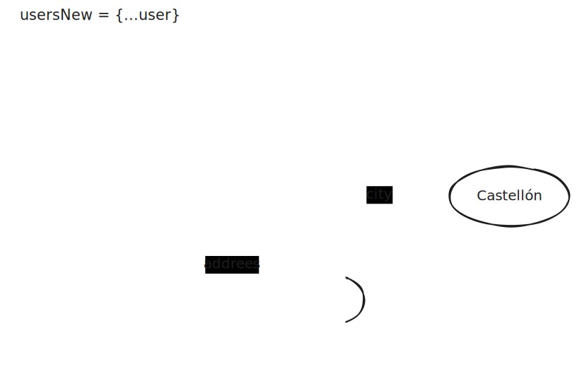
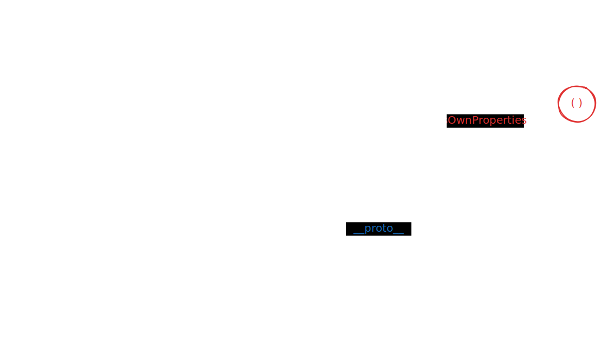
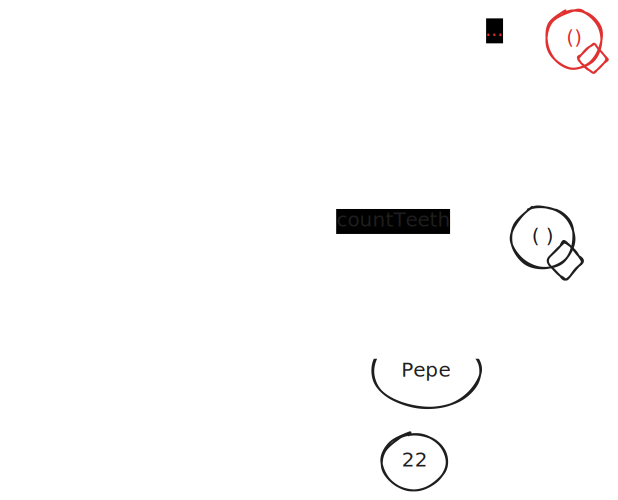
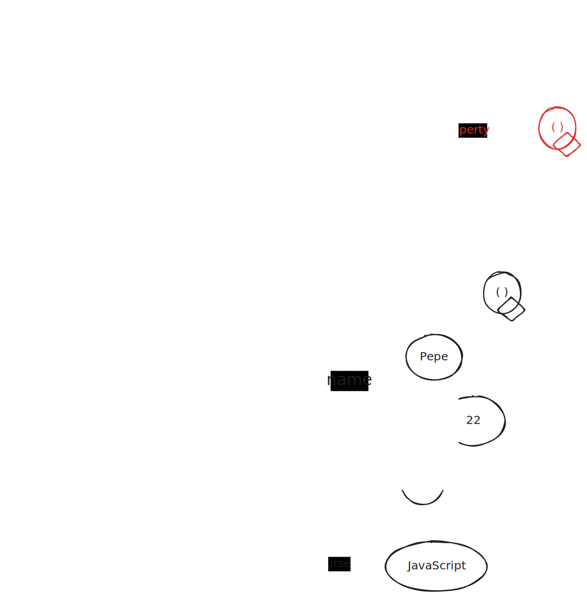
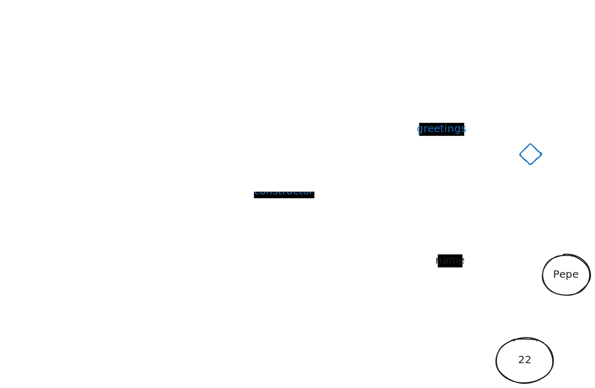
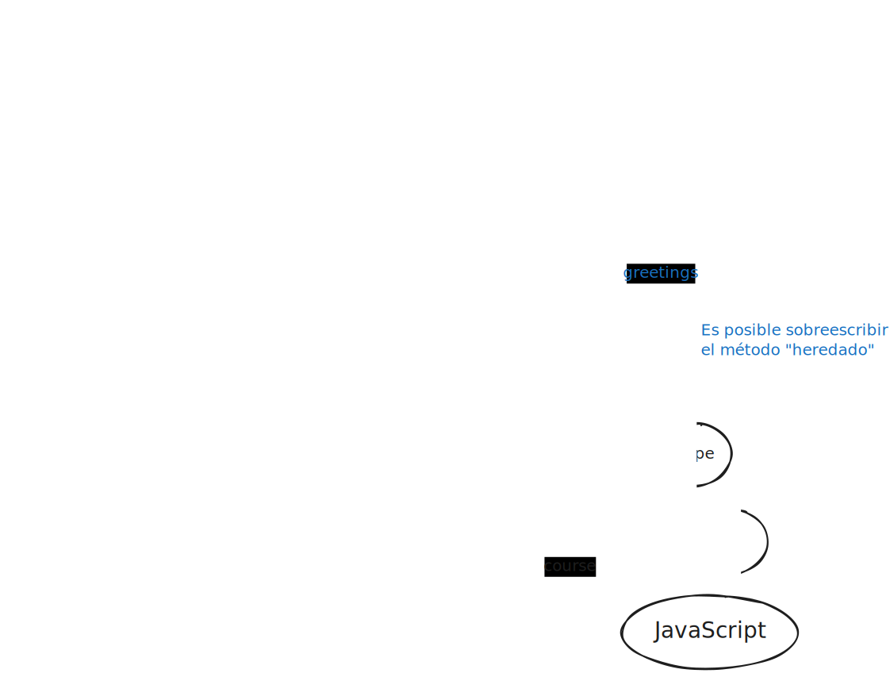
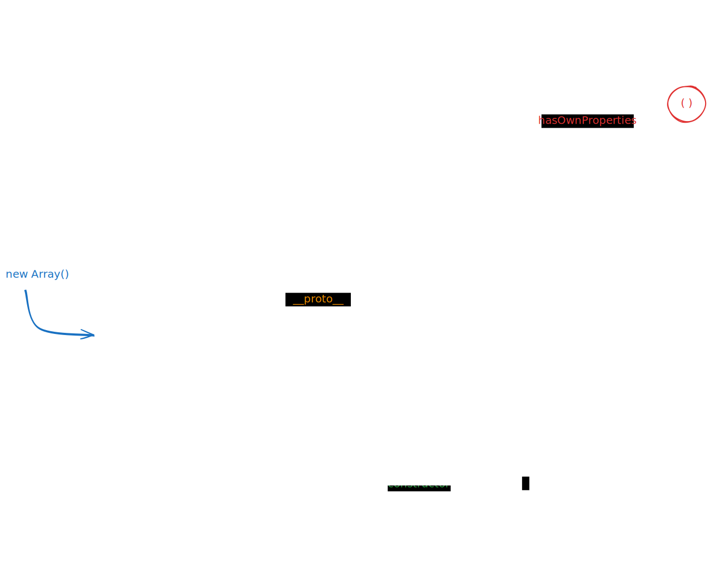

# Funciones y objetos

## Índice

- [Funciones y objetos](#funciones-y-objetos)
  - [Índice](#índice)
  - [Funciones](#funciones)
    - [Creación y uso](#creación-y-uso)
      - [Declaración v. asignación](#declaración-v-asignación)
      - [Ejecución, invocación o llamada](#ejecución-invocación-o-llamada)
      - [Re-asignación](#re-asignación)
      - [Hoisting](#hoisting)
    - [Ámbito (scope) de las variables](#ámbito-scope-de-las-variables)
    - [Parámetros v. argumentos](#parámetros-v-argumentos)
      - [Argumentos de tipo primitivo](#argumentos-de-tipo-primitivo)
      - [Argumentos de tipo referenciado](#argumentos-de-tipo-referenciado)
  - [Des-estructuración (Destructuring)](#des-estructuración-destructuring)
    - [Des-estructuración en la declaración de variables](#des-estructuración-en-la-declaración-de-variables)
    - [Des-estructuración en la asignación de valores a las variables](#des-estructuración-en-la-asignación-de-valores-a-las-variables)
    - [Des-estructuración en la declaración de parámetros](#des-estructuración-en-la-declaración-de-parámetros)
    - [Operador spread (extendido)](#operador-spread-extendido)
      - [Shallow clone (or copy)](#shallow-clone-or-copy)
      - [Deep clone (or copy)](#deep-clone-or-copy)
    - [Operador rest](#operador-rest)
  - [Objetos](#objetos)
    - [Creación y tipos de objetos](#creación-y-tipos-de-objetos)
      - [Objetos literales](#objetos-literales)
      - [Objetos construidos](#objetos-construidos)
    - [Propiedades de los objetos](#propiedades-de-los-objetos)
      - [Niveles](#niveles)
        - [Anidamiento y propiedades undefined](#anidamiento-y-propiedades-undefined)
        - [Anidamiento y clonación](#anidamiento-y-clonación)
      - [Iteraciones](#iteraciones)
    - [Objetos y prototipos](#objetos-y-prototipos)
      - [Propiedades del prototipo original](#propiedades-del-prototipo-original)
      - [Prototipos y funciones](#prototipos-y-funciones)
      - [Cambiando el prototipos](#cambiando-el-prototipos)
      - [Cadena de prototipos](#cadena-de-prototipos)
  - [Paradigma funcional: funciones como objetos](#paradigma-funcional-funciones-como-objetos)
    - [Funciones con propiedades 'extra'](#funciones-con-propiedades-extra)
    - [Funciones anidadas](#funciones-anidadas)
    - [Funciones de orden superior y callbacks](#funciones-de-orden-superior-y-callbacks)
    - [Funciones auto-invocadas](#funciones-auto-invocadas)
    - [Closures](#closures)
  - [Paradigma de orientación a objetos: clases](#paradigma-de-orientación-a-objetos-clases)
    - [Patrones de ejecución de las funciones](#patrones-de-ejecución-de-las-funciones)
    - [Funciones constructoras](#funciones-constructoras)
      - [Funciones constructoras y prototipos](#funciones-constructoras-y-prototipos)
      - [Métodos de instancia y métodos de prototipo](#métodos-de-instancia-y-métodos-de-prototipo)
      - [Propiedades y Métodos estáticos (de "clase")](#propiedades-y-métodos-estáticos-de-clase)
      - [Herencia](#herencia)
      - [Funciones constructoras nativas de JS](#funciones-constructoras-nativas-de-js)
    - [Clases en ES6](#clases-en-es6)
    - [Accessors: getters y setters](#accessors-getters-y-setters)
    - [JS y la programación orientada a objetos](#js-y-la-programación-orientada-a-objetos)

## Funciones

Son

- conjuntos de instrucciones,
- generalmente asociados a un **identificador**,
- gracias a lo cual pueden ser **invocadas** (ejecutadas)
- con su propio espacio de memoria (**scope**)

En todos los casos, cuando concluyen la ejecución, **retornan** (devuelven) un valor.
Si este es undefined la función se considera de tipo **void**.

### Creación y uso

En JS las funciones son también valores y su tipo es el de **objetos 'de pleno derecho**.
Esto determina que ademas de declararlas, sea posible asignarlas a una variable, como sucede con cualquier valor (incluidos los de tipo objeto)

#### Declaración v. asignación

Se pueden crear funcione mediante **declaración**

En ella se incluye la implementación (cuerpo de la función): el conjunto de funciones que será ejecutado.

```js
function foo() {
  // Implementación
  console.log('Soy foo');
}
```

la alternativa es la **asignación** de una **expresión functional** (function expression) o **función anónima** a una variable

```js
const bar = function () {
  // Implementación
};
```

En ES6, la expresión funcional puede escribirse como **arrow function** [_🗓️ES2015_]

```js
const arrow = () => {
  // Implementación
};
```

Cuando las arrow functions son de una sola línea que directamente retorna una expresión, pueden omitirse las llaves ({}) y el return

```js
const add = (a, b) => a + b;
```

Las arrow functions usan un **lexical scope**, a diferencia del **dynamic scope** de las funciones habituales.

Eso obliga a tener en cuenta algunas limitaciones en su uso

- no suelen usarse como **métodos**, ya que si lo son, no tendrán acceso al objeto mediante `this` ni al padre como `super`
- no pueden usarse como funciones **constructoras**
- no pueden usarse como **generadores** porque en su implementación no pueden usar el operador `yield`

#### Ejecución, invocación o llamada

Cualquiera que sea la forma en que se a creado, la función se invoca o ejecuta usando su identificador + el **operador de invocación**, los paréntesis

```js
identificador();
```

En ese momento, js crea un nuevo entorno de ejecución (**execution scope**) en el que existen las variables locales de la función (incluidos los parámetros)

Cuando la ejecución concluye, la función devuelve el valor que corresponda (puede ser undefined), y el entorno de ejecución desaparece, con todas las variables locales que incluya

#### Re-asignación

Usando el identificador de una función, sin el operador de invocación (los paréntesis), puede asignarse su valor a otra variable.

Tendremos así dos identificadores diferentes que hacen referencia a una misma función (bloque de código)

```js
const countWeekDays = function () {
  return 7;
};

const weekDays = countWeekDays;
console.log(weekDays);

console.log(countWeekDays());
console.log(weekDays());
```

#### Hoisting

La llamada (o invocación) a la función declarada como función puede ser anterior a su declaración.
Esto se debe al proceso conocido como alzamiento (**hoisting**) o visibilidad sintáctica: las declaraciones de variables con var y las funciones declaradas con function son alzadas al principio por el interprete de JS

```js
foo(); // Ejemplo de Hoisting
// ReferenceError bar();
// ReferenceError arrow();

function foo() {
  // Implementación
}

const bar = function () {
  // Implementación
};

const arrow = () => {
  // Implementación
};
```

Cuando una función se crea mediante asignación a una variable, el proceso de alzamiento no se produce

### Ámbito (scope) de las variables

Las variables declaradas directamente fuera de cualquier función tienen un ámbito global o del módulo en que existen.

Las variables declaradas como parámetros o dentro de una función tienen un ámbito local a la función.

- no pueden ser accedidas desde fuera de la función
- desaparecen cuando concluye la ejecución de la función

Cuando el identificador de una variable local es el mismo que el de una de ámbito (scope) superior, ensombrece (shadow) a esta última, de modo que no puede ser accedida.

```js
let text1 = 'Valor inicial';
let text2 = 'Valor inicial';

function foo() {
  var text1;
  text1 = 'Cambio desde dentro';
  text2 = 'Cambio desde dentro';
}

foo();
console.log(text1); // "Valor inicial"
console.log(text2); // "Cambio desde dentro
```

Al contrario de lo que sucede en el ejemplo, una función **no debe** acceder a las variables globales, para evitar que quede **acoplada** al código principal

### Parámetros v. argumentos

Al invocar una función se incluyen los **argumentos** (también denominados parámetros reales) necesarios: valores obtenidos al evaluar la expresión que se envían a la función

La función recibe esos valores en variable locales denominadas **parámetros** (o parámetros formales) que se utilizan como parte de las operaciones llevadas a cabo en el cuerpo (implementación) de la función.

```js
const add = (x, y) => {
  const r = x + y;
  return r;
};
```

La función tiene 3 variable locales:
r y los parámetros x e y, que se inicializarán con los valores recibidos como argumentos.

```js
const x = 5;
console.log('Add', add(x)); // NaN
console.log('Add', add(x, 4)); // 9
console.log('Add', add(x, 4, 8)); // 9
```

La función se invoca con diferente número de argumentos

- si hay menos argumentos que parámetros, los que no reciben argumento se inicializan con valor undefined
- si hay más argumentos que parámetros, los que sobran se ignoran

En ES6 es fácil definir los **valores por defecto**, de los parámetros, de forma que se inicialicen con esos valores en caso de no recibir ningún valor como argumento

```js
const add = (x = 0, y = 0) => {
  const r = x + y;
  return r;
};

const x = 5;
console.log('Add', add()); // 0
console.log('Add', add(x)); // 5
```

En VSC los valores por defecto se utilizan para inferir el tipo de los parámetros, aunque ello no signifique que se fija ese tipo, como ocurriría en TypeScript

#### Argumentos de tipo primitivo

Si los argumentos son valores primitivos, lo que reciben los parámetros es el **valor**.

La función nunca cambia el valor de la variable que se usa como argumento, a no ser que la manipule directamente y esto último no debería ocurrir nunca.

```js
const foo = (x) => {
  x = x + 1;
  console.log('Valor de x local a foo', x); // 3
  return x;
};

const x = 2;
console.log('Valor inicial de x global', x); // 2
foo(x);
console.log('Valor finas de x global', x); // 2
```

#### Argumentos de tipo referenciado

Si los argumentos son objetos (valores primitivos), lo que reciben los parámetros es la **referencia** a la instancia del objeto.

Si la función **muta el objeto**, el cambio afecta a la instancia original, que es la única que existe

```js
const foo = (x) => {
  x.user = 'Juan';
  console.log('Valor de x local a foo', x); //  { user: 'Juan' }
  return x;
};

const x = { user: 'Pepe' };
console.log('Valor inicial de x global', x); //  { user: 'Pepe' }
foo(x);
console.log('Valor finas de x global', x); //  { user: 'Juan' }
```

## Des-estructuración (Destructuring)

[_🗓️ES2015_]

En el proceso de declaración de las variables y parámetros, si el valor asignado es un objeto (o array), pueden recogerse por separado sus propiedades o items en variables completamente independientes

### Des-estructuración en la declaración de variables

```js
const createArray = () => [1, 2];
const createObject = () => ({
  name: 'Pepe',
  age: 22,
});

const [first, second] = createArray();
const { name, age } = createObject();

console.log(first, second); // 1 2
console.log(name, age); // Pepe 22
```

### Des-estructuración en la asignación de valores a las variables

```js
let [first, second] = createArray();
let { name, age } = createObject();

[first, second] = [10, 20];
({ name, age } = { name: 'Jose', age: 30 });

console.log(first, second); // 10 20
console.log(name, age); // Jose 30
```

### Des-estructuración en la declaración de parámetros

```js
const useArray = ([first, second]) => {
  console.log(first);
  console.log(second);
};

useArray([1, 2]);

const useObject = ({ name, age }) => {
  console.log(name);
  console.log(age);
};

useObject({
  name: 'Pepe',
  age: 22,
});
```

### Operador spread (extendido)

Permite la expansión de iterables (arrays y strings) y objetos

- un iterable (arrays y strings) puede ser expandido
  - en llamadas de función con cero o más argumentos esperados
  - en objetos o arrays literales, donde se esperan nuevos elementos

Su uso en la llamada a una función permite pasar un número indefinido de argumentos, extraídos a partir de un array

```js
const addTwoNumbers = (a, b) => a + b;
const numbers = [1, 2];
const result = addTwoNumbers(...numbers);

console.log(result); // 3
```

#### Shallow clone (or copy)

En la creación de arrays literales, el operador spread permite la expansión de un objeto o array en lugares donde se esperan cero o más elementos

```js
const numbers = [1, 2];
const numbersB = [...numbers];
console.log(numbersB); // [1,2]
```

Posteriormente JS añadió la posibilidad de expandir un objeto en lugares donde son esperados cero o más pares de valores clave (para literales tipo Objeto) [_🗓️ES2018_]

```js
const obj = { name: 'Pepe', age: 22 };
const objB = { ...obj, age: 23 };

console.log(objB); // { name: 'Pepe', age: 23 }
```

El spread operator se convierte así en un mecanismo para la **copia o clonación** de objetos (incluidos arrays): obtener una nueva instancia con las mismas propiedades o incluso con la mutación de algunas

Este mecanismo no afecta a niveles anidados, es decir a arrays de arrays o propiedades de tipo objeto, por lo que se denomina **shallow copy**



#### Deep clone (or copy)

Para conseguir un deep clone pueden usarse 2 técnicas

- uso de los métodos estáticos de JSON (stringify y parse)
- uso del la nueva función global `structuredClone` incluida en las APIs del browser y node (desde su versión 11)

```js
const user = {
  name: {
    firstName: 'Pepe',
    surname: 'Perez',
  },
  age: 22,
};

const userB = JSON.parse(JSON.stringify(user));
console.log(userB);

const userC = structuredClone(userB);
console.log(userC);
```

### Operador rest

El operador rest al usarse en la sintaxis de los parámetros de una función le permite recibir un número indefinido de argumentos como un array, permitiendo así representar funciones 'variadicas' (variadic functions) en JavaScript

```js
const sumNumbers = (...numbers) => {
  let accumulator = 0;
  for (const iterator of numbers) {
    accumulator += iterator;
  }
  return accumulator;
};

console.log(sumNumbers(2, 5, 3, 5, 2, 7, 7)); // 31
```

También puede emplearse el operador rest como parte del proceso de des-estructuración

```js
const numbers = [1, 2, 3, 4, 5];
const [first, second, ...others] = numbers;
console.log(others); // [ 3, 4, 5 ]
```

Esté último caso puede igualmente ocurrir con objetos [_🗓️ES2018_]

```js
const { first, second, ...others } = {
  first: 1,
  second: 2,
  third: 3,
  fourth: 4,
  fifth: 5,
};

console.log(first); // 1
console.log(second); // 2
console.log(others); // { third: 3, fourth: 4, fifth: 5 }
```

## Objetos

Como ya sabemos acerca de los objetos

- son valores de tipo referenciado
- son colecciones de **propiedades**, que a su vez son pares clave-valor
- los valores de las propiedades corresponden a datos de cualquier tipo: primitivos, objetos o funciones
  - En el caso de los arrays, los identificadores de las propiedades son indices numéricos que permiten la iteración a lo largo del array
- cuando una propiedad es de tipo función se denomina método.

### Creación y tipos de objetos

Los objetos pueden declararse:

- literalmente
- con el patron constructor

#### Objetos literales

JS permite crear de forma literal objetos, arrays y expresiones regulares (RegExp),
todos ellos variaciones del tipo **object**

```js
const user = {
  name: 'Pepe',
  age: 22,
};

// Array
const numbers = [1, 2, 3, 4];

// Regular Expression (RegExp)
const regExp = /a/i;

console.log(user); // { name: 'Pepe', age: 22 }
console.log(numbers); // [ 1, 2, 3, 4 ]
console.log(regExp); // /a/i
```

Esta forma de notación se conoce con **JavaScrip Object Notation (JSON)** y ha dado lugar a un formato de **ficheros, json**, convertido prácticamente en el estándar de intercambio de datos entre distintas capas de software (servidores, clientes...)

- se utilizan siempre dobles comillas (")
- las claves o propiedades siempre van entre comillas, al igual que los valores de tipo string

El formato literal es solo una notación.
Los objetos obtenidos son exactamente los mismos que los que resultarían del patron constructor: instancias de la misma función constructora y con el mismo prototipo, del que pueden tomar las propiedades comunes a todas las instancias de dicha función constructora (clase)

```js
const user = {
  name: 'Pepe',
  age: 22,
};

// Array
const numbers = [1, 2, 3, 4];

// Regular Expression (RegExp)
const regExp = /a/i;

console.log(user);
console.log(user.constructor); // [Function: Object]
console.log(Object.getPrototypeOf(user)); // [Object: null prototype] {}
console.log(user instanceof Object); // true

console.log(numbers);
console.log(numbers.constructor); // [Function: Array]
console.log(Object.getPrototypeOf(numbers)); // Object(0) []
console.log(numbers instanceof Object); // true
console.log(numbers instanceof Array); // true

console.log(regExp);
console.log(regExp.constructor); // [Function: RegExp]
console.log(Object.getPrototypeOf(regExp)); // {}
console.log(regExp instanceof Object); // true
console.log(regExp instanceof RegExp); // true
```

#### Objetos construidos

Desde la aparición de JS, Los objetos pueden crearse como nuevas **instancias** resultantes de emplear el patron constructor (new) con una **función constructora**, de forma similar a como otros lenguajes utilizan las clases.

A partir de ES6, comienza a usarse la palabra reservada **class** y se habla de **clases** para referirse al proceso antes mencionado, de creación de instancias a partir de funciones constructoras (ahora con apariencia de clases)

```js
const user = new Object({
  name: 'Pepe',
  age: 22,
});

console.log(user); // { name: 'Pepe', age: 22 }

// Array
const numbers = new Array(1, 2, 3, 4);
console.log(numbers); // [ 1, 2, 3, 4 ]

// Regular Expression (RegExp)
const regExp = new RegExp(/a/i);
console.log('RegExp new', regExp); // /a/i

// Date
const date = new Date();
console.log(date); // 2023-08-19T11:56:56.079Z

// Error
const error = new Error('Some error');
console.log(error); // Error: Some error
```

### Propiedades de los objetos

Cualquiera que sea la forma en que se han creado, los objetos tienen propiedades a las que se puede acceder mediante dos formas de notación

- puntos (dot notation)
- corchetes (bracket notation)

```js
{
  const user = {
    name: 'Pepe',
  };
  console.log(user['name']); // Pepe

  const property = 'name';
  console.log(user[property]); // Pepe
}
```

La notación de corchetes solo se utiliza si el **nombre de la propiedad** es una **variable**, que debe ser evaluada para luego acceder a la propiedad correspondiente al valor de la variable

Con ambas notaciones es posible leer, modificar crear y eliminar propiedades.

```js
const obj = {
  name: 'Pepe',
  age: 22,
};
// Añadimos propiedades
obj.lastName = 'Perez';
// Modificamos propiedades
obj.name = 'Jose';
// Eliminamos propiedades
delete obj.age;
console.log(obj);
```

Todos estos cambios se enmarcan en el concepto de **mutabilidad** de los objetos

#### Niveles

Las propiedades de los objetos pueden ser otros objetos, dando lugar a tantos niveles de anidamiento o profundidad como sea necesario.

Así se refleja tanto en su creación como en el acceso a las propiedades en cualquiera de las notaciones.

```js
const user = {
  name: {
    firstName: 'Pepe',
    surname: 'Perez',
  },
};
user.address = {};
user.address.street = 'c/ del Pez';
user['address'].number = '22 3ª C';
user['address']['city'] = 'Teruel';

console.log(user);
// { name: { firstName: 'Pepe', surname: 'Perez' },
// address: { street: 'c/ del Pez', number: '22 3ª C', city: 'Teruel' } }
```

##### Anidamiento y propiedades undefined

Si se accede a cualquier propiedad de un objeto que no existe, el valor devuelto es undefined

Sin embargo si se intenta acceder a una propiedad de una propiedad que no existe, de desencadena un TypeError.

Para evitarlo puede usarse el operador **optional chaining** (?.), que no continua a un siguiente nivel de anidamiento cuando obtiene un undefined o null en el anterior, devolviendo en ese caso un undefined

```js
const obj = {
  name: 'Pepe',
  age: 22,
};
console.log(obj.address); // undefined
try {
  console.log(obj.address.city);
} catch (error) {
  console.log(error.name); // TypeError
  console.log(error.message); // Cannot read properties of undefined (reading 'city')
}
console.log(obj.address?.city); // undefined
```

##### Anidamiento y clonación

Este posible anidamiento debe tenerse en cuenta al plantear el proceso de clonación o deep copy de un objeto, consistente en crear una instancia nueva.

Algunas de las formas de obtener este resultado no lo hacen en profundidad, y solo crean una shallow copy de las estructuras anidadas:

- Object.assign()
- {...Object}

Existen otras alternativas que si crean una deep copy a todos los niveles:

- JSON.parse(JSON.stringify(object))
- structuredClone()

#### Iteraciones

Los objetos no son iterables, como arrays y strings, por lo que no pueden recorrerse en base a un índice numérico, como hacen for y for-of.

Las iteraciones en los objetos de JS pueden realizarse con la estructura for-in, que ya conocemos.

### Objetos y prototipos

Todos los objetos tiene una propiedad especial llamada `__proto__`" que apunta a otro objeto, conocido como su **prototipo**.
Los objetos acceden de forma transparente al objeto al que apunta la propiedad `__proto__`.

El prototipo de un objeto suele ser el **prototype** de la función constructora del objeto. De esta forma se aplica el **patrón prototype** para conseguir una relación entre objetos asimilable a las **clases** de otros lenguajes de programación

#### Propiedades del prototipo original

El prototipo por defecto de los objetos incluye una serie de propiedades y métodos accesibles de forma transparente por todos los objetos, que en general no se utilizan demasiado

```js
const obj = new Object({
  name: 'Pepe',
  age: 22,
});

console.log(obj.constructor);
console.log(obj.hasOwnProperty('name')); // true
console.log(obj.isPrototypeOf({})); // false
console.log(obj.propertyIsEnumerable('name')); // true
console.log(obj.toString()); // [object Object]
console.log(obj.toLocaleString()); // [object Object]
console.log(obj.valueOf()); // { name: 'Pepe', age: 22 }
```


#### Prototipos y funciones

En términos prototípicos, las funciones son objetos un poco especiales, que tienen una propiedad especial llamada `prototype` que apunta a otro objeto, conocido como su **prototipo**.

Este objeto, como cualquier otro, tiene una propiedad `__proto__` que por defecto apunta al prototipo de todos los objetos.


Por su parte, el objeto prototipo por defecto de todos los demás es el prototipo de la función constructora Object.

Este objeto, como cualquier otro, tiene una propiedad `__proto__` que por defecto apunta a null.



#### Cambiando el prototipos

Se puede crear un objeto literal que tenga como prototipo (`__proto__`) cualquier otro objeto

La forma "incorrecta" de hacerlo es mediante la asignación directa de la propiedad `__proto__` al objeto literal

```js
const person = {
  teeth: 32,
  renderTeeth() {
    console.log('Tengo', this.teeth, 'dientes');
  },
};

const user = {
  name: 'Pepe',
  age: 22,
  __proto__:
}
user.__proto__= person;
```

La forma correcta de hacerlo es mediante la función `Object.create()`, que recibe como argumento el objeto que se desea que sea el prototipo del nuevo objeto

```js
const person = {
  teeth: 32,
};

const user = Object.create(person);

user.name = 'Pepe';
user.age = 22;

console.log(user);
user.renderTeeth(); // Tengo 32 dientes
```

Otra forma también válida es usando Object.setPrototypeOf(), que recibe como primer argumentos el objeto al que se le va a cambiar el prototipo y como segundo el objeto que va a ser el nuevo prototipo

```js
const person = {
  teeth: 32,
};

const user = {
  name: 'Pepe',
  age: 22,
};

Object.setPrototypeOf(user, person);

console.log(user);
user.renderTeeth(); // Tengo 32 dientes
```

En cualquiera de los casos, el nuevo objeto podrá acceder de forma transparenta a las propiedades de su prototipo, siempre que no existan en el mismo objeto



#### Cadena de prototipos

La relación entre objetos y prototipos puede ser en cadena, de forma que un objeto puede ser el prototipo de otro objeto que a su vez es el prototipo de otro objeto. Este patrón se conoce como **cadena de prototipos** (**prototype chain**) y de lugar a la **herencia prototípica**

Si una propiedad no se encuentra en el objeto, se busca en su prototipo, y así sucesivamente hasta llegar al prototipo de todos los objetos, Object.

```js
const alumno = {
  course: 'JavaScript',
  __proto__: person,
};

console.log(alumno);
console.log(alumno.name); // Pepe
alumno.renderTeeth(); // Tengo 32 dientes
```



En cualquier punto de la cadena de prototipos puede darse es **ocultamiento** (**shadowing**) de propiedades disponibles en niveles superiores.
Si una propiedad se encuentra en el objeto, no se busca en su prototipo, ni en los sucesivos prototipos de la cadena.

## Paradigma funcional: funciones como objetos

Ya sabemos que en JS las funciones son también valores y su tipo es el de **objetos 'de pleno derecho**.

Entre otras cosas

- pueden tener propiedades
- pueden ser asignadas a una variable
- pueden ser incluidas (anidadas) en otra función
- pueden ser recibidas como parámetros
- pueden ser devueltas por otra función

### Funciones con propiedades 'extra'

Aunque no suele hacerse, una función puede tener propiedades como cualquier otro objeto

```js
const foo = () => {
  console.log('Soy foo');
};

foo.date = new Date();

console.log(foo);
// [Function: foo] { date: 2023-08-16T11:23:04.205Z }
```

### Funciones anidadas

```js
function addSquares(a, b) {
  function square(x) {
    return x * x;
  }

  return square(a) + square(b);
}

console.log(addSquares(4, 5)); // 41
```

La función 'interna' square solo existe en el scope de la otra y solo puede ser utilizada dentro de ella

### Funciones de orden superior y callbacks

Una función de orden superior (**hight order function**) es la que

- recibe una función como parámetro
- devuelve una función

La función recibida como parámetro se denomina **callback**

```js
const hof = (callback) => {
  console.log(callback());
};

hof(() => 'Soy un callback');
```

Los callback pueden ser indistintamente funciones con nombre o anónimas, aunque esta segunda opción es muy habitual, como lo es en ese caso el uso de las arrow functions

Entre los usos más habituales de los callbacks:

- permitir asignar funciones como manejadores de eventos asíncronos
- asignar funciones a timeouts, como otra forma de asincronía

### Funciones auto-invocadas

Después de la declaración de una función anónima (expresión funcional), es posible que ésta se invoque a si misma para ser ejecutada inmediatamente

El patrón de esta práctica se denomina IIFE (**Immediately Invoked Function Expression**)

```js
(() => {
  console.log('Ejemplo de una IIFE');
})();
```

La creación de su propio espacio de memoria en las funciones hace que se puedan utilizar para aislar un código fuente y evitar colisiones de variables o espacios de nombres en general: El código se ejecuta directamente, como si no hubiera función, pero en su propio espacio de memoria

### Closures

Una función que encapsula un conjunto de definiciones locales :

- variables,
- otras funciones (por extensión objetos).

Se basa por tanto en el anidamiento de funciones.

- permite que la función interna "escape" de la función padre: se hace accesible desde fuera
- la función interna sigue teniendo acceso al ámbito (scope) de la función padre después de que ésta haya retornado

El ámbito de visibilidad de la función externa se utiliza para crear el equivalente a un módulo

Las funciones internas pueden ser setters y getters de variables locales, no accesibles directamente desde fuera

Se pueden utilizar varios patrones para conseguir un closure:

- una función incluye una función interna y la devuelve
- una función incluye una función interna y se la asigna a una variable del nivel superior

```js
const closureCount = () => {
  let counter = 0;
  return () => counter++;
};

const extCounter = closureCount();

console.log(extCounter()); // 0
console.log(extCounter()); // 1
console.log(extCounter()); // 2
```

En el primero de los patrones puede añadirse una IIFE

```js
const closureCount = (() => {
  let counter = 0;
  return () => counter++;
})();

console.log(closureCount()); // 0
console.log(closureCount()); // 1
console.log(closureCount()); // 2
```

## Paradigma de orientación a objetos: clases

Como hemos visto, en JS Los objetos pueden declararse:

- literalmente
- con el patron constructor

Los objetos literales tienen como característica que en principio creamos cada uno de forma independiente, lo que en muchos contextos no es lo más adecuado.

```js
const user1 = {
  name: 'Pepe',
  age: 22,
  greeting() {
    console.log(`Hola, soy ${this.name}`);
  },
};

const user2 = {
  name: 'Ernestina',
  age: 23,
  greeting() {
    console.log(`Hola, soy ${this.name}`);
  },
};

user1.greeting();
user2.greeting();

console.log(user1);
console.log(user2);
```

La alternativa es el patrón constructor, y para entenderlo es necesario conocer los distintos patrones de ejecución de las funciones en JS.

### Patrones de ejecución de las funciones

Una función puede ser ejecutada de 4 formas diferentes, y en cada una de ellas el valor de `this` es diferente

Tomamos como ejemplo una función que simplemente imprime el valor de `this`

```js
function foo() {
  console.log('Este es el valor de this:', this);
}
```

Podemos ejecutarla siguiendo 4 patrones diferentes

- como una función (**function pattern**)

El valor de this depende de si esta activado o no el modo estricto

- si no lo está, this es el objeto global
- si lo está, this es undefined

```js
foo(); // Este es el valor de this: <ref *1> Object [global] { ... }

('use strict');
foo(); // Este es el valor de this: undefined
```

- como un método (**method pattern**)

El valor de this es el objeto al que pertenece la función
Para probarlo asignamos la función a una propiedad de un objeto y la invocamos

```js
const obj = {
  foo, // Eq. foo: foo
};

obj.foo(); // Este es el valor de this: { foo: [Function: foo] }
```

- como un constructor (**constructor pattern**)

La función se invoca con el operador new, y el valor de this es un objeto vacío que se crea automáticamente y se asigna a la variable this

```js
new foo(); // Este es el valor de this: foo {}
```

- de forma indirecta (**apply/call pattern**)

La función puede ser invocada desde el contexto de otro objeto, mediante los métodos apply o call de la propia función, que permiten asignar un valor a this pasado como argumento.

```js
const obj2 = {
  name: 'Object 2',
};

foo.apply(obj2); // Este es el valor de this: { name: 'Object 2' }
```

En definitiva vemos que cualquier función puede ser un constructor, cuando se una el operador new. En ese caso

1 - Se crea un objeto nuevo
2 - Este es asignado a la propiedad this de la función
3 - El código de la función puede modificar el objeto recién creado
3 - La función devuelve el objeto

### Funciones constructoras

Lo interesante es implementar funciones pensadas para ser usadas como constructores, y que devuelvan un objeto con propiedades y métodos. Estas funciones se denominan **funciones constructoras** y pos convenio se escriben con la primera letra en mayúsculas

```js
function User(name, age) {
  this.name = name;
  this.age = age;
  this.greeting = function () {
    console.log(`Hola, soy ${this.name}`);
  };
}

const user1 = new User('Pepe', 33);
const user2 = new User('Ernestina', 22);
const user3 = new User('Ramon', 45);

console.log(user1);
console.log(user2);
console.log(user3);
```

El patrón constructor es el más habitual en la **programación orientada a objetos** en JS, y se utiliza para crear instancias de objetos que comparten propiedades y métodos.

De forma similar a como hacen las clases en otros lenguajes, las funciones constructoras permiten crear instancias de objetos con propiedades y métodos comunes.
Hay sin embargo una importante diferencia entre ambos conceptos:

- Los objetos basados en clases de otros lenguajes se ajusta rígidamente a las definiciones de la clase, que pueden entenderse como **plantillas** con las que se crean objetos
- Los objetos basados en funciones constructoras de JS son tan flexibles como los objetos literales, y permiten la creación de objetos con propiedades y métodos comunes, pero también la modificación de esas propiedades y métodos en cada instancia

```js
const user4 = new User('Pepe', 33);
user4.surname = 'Perez';
delete user4.age;

console.log(user4); // { name: 'Pepe', greeting: [Function], surname: 'Perez' }
```

#### Funciones constructoras y prototipos

Cuando una función utiliza el patrón constructor, se crea un objeto que tiene como prototipo el prototipo de la función constructora.

```js
const User = function (name, age) {
  this.name = name;
  this.age = age;
};

Person.prototype.teeth = 32;

const pepe = new Person('Pepe', 22);
console.log(pepe);
console.log(pepe.teeth); // 32
```

El objeto creado con el operador new tiene además una propiedad especial `constructor` que apunta a la función constructora.

```js
pepe.__proto__ === Person.prototype; // true
pepe.constructor === Person; // true
```



#### Métodos de instancia y métodos de prototipo

En el ejemplo anterior, el método `greeting` es un método de instancia, ya que se crea en cada objeto creado con la función constructora. Esto puede ser un problema si se crean muchos objetos, ya que se duplica el código de la función en cada uno de ellos.

En JS lo habitual es almacenar los métodos en el prototipo de la función constructora, de forma que se comparten entre todas las instancias de la función constructora, siendo accesibles de forma transparente, como ya sabemos que sucede con todas las propiedades del prototipo. Así se muestra en la imagen anterior

```js
const User = function (name, age) {
  this.name = name;
  this.age = age;
};

User.prototype.greeting = function () {
  console.log(`Hola, soy ${this.name}`);
};

const pepe = new User('Pepe', 22);
const ernestina = new User('Ernestina', 23);

pepe.greeting();
ernestina.greeting();

console.log(pepe);
console.log(ernestina);
```

#### Propiedades y Métodos estáticos (de "clase")

La propia función constructora puede tener propiedades y métodos que no se comparten con las instancias de la función constructora, sino que son propias de la función constructora.

Estas propiedades y métodos se denominan **estáticos** y se definen directamente en la función constructora

```js
const User = function (name, age) {
  this.name = name;
  this.age = age;
  User.count++;
};

User.prototype.greeting = function () {
  console.log(`Hola, soy ${this.name}`);
};

User.count = 0;
User.getCount = function () {
  return User.count;
};

const pepe = new User('Pepe', 22);
const ernestina = new User('Ernestina', 23);

console.log(User.getCount()); // 2
```

#### Herencia

En JS la herencia se basa en la cadena de prototipos, y se consigue mediante la asignación de un objeto a la propiedad `prototype` de la función constructora

```js
const Person = function (name, age) {
  this.name = name;
  this.age = age;
};

Person.prototype.greeting = function () {
  console.log(`Hola, soy ${this.name}`);
};

const Student = function (name, age, course) {
  Person.call(this, name, age);
  this.course = course;
};

Student.prototype = Object.create(Person.prototype);
// Student.prototype.__proto__ = Person.prototype;
Student.prototype.constructor = Student;

Student.prototype.greeting = function () {
  Person.prototype.greeting.call(this);
  console.log(`Estudio ${this.course}`);
};

const pepe = new Student('Pepe', 22, 'JavaScript');
pepe.greeting();
```

En este caso, la función constructora Student hereda de la función constructora Person, y se crea una nueva cadena de prototipos, en la que el prototipo de Student es el prototipo de Person.



#### Funciones constructoras nativas de JS

JS incluye funciones constructoras nativas que permiten crear objetos de tipos primitivos y objetos

- String
- Number
- Boolean
- Array
- Object
- Function
- ...

En los prototipos de estas funciones constructoras se encuentran los métodos y propiedades que permiten trabajar con estos tipos de datos, al ser accedidas de forma transparente por todos los objetos creados con estas funciones constructoras.

```js
const str = 'Hola';
console.log(str.length); // 4
console.log(str.toUpperCase()); // HOLA
const arr = [1, 2, 3];
console.log(arr.length); // 3
console.log(arr.push(4)); // 4
console.log(Array.isArray(arr)); // true
```

En muchos casos, estas funciones constructoras se utilizan tanbien como funciones de conversión de tipos, para convertir valores de un tipo a otro, cuando de invocan con el patrón function, es decir sin el operador new

```js
const num = Number('22');
console.log(typeof num); // number
```

Todas ellas heredan de la función constructora Object, y por tanto tienen acceso a las propiedades y métodos de Object, que por su parte tiene como prototipo el valor null, que de esa forma pone fin a la cadena de prototipos.

```js
const data = [1, 2, 3];
console.log(data.constructor); // [Function: Array]
console.log(data instanceof Array); // true
console.log(data instanceof Object); // true

const foo = () => {};
console.log(foo.constructor); // [Function: Function]
console.log(foo instanceof Function); // true
console.log(foo instanceof Object); // true

const obj = {};
console.log(obj.constructor); // [Function: Function]
console.log(obj instanceof Object); // true
```



### Clases en ES6

A partir de ES6, JS incluye la palabra reservada **class** que permite definir una función constructora de forma más clara y sencilla, y que se asemeja a la sintaxis de las clases de otros lenguajes de programación.

Internamente no cambia nada respecto a lo que hemos visto hasta ahora, y sigue siendo una función constructora que crea objetos con propiedades y métodos. Por eso se dice que las clases en JS son **azúcar sintáctica**. Prueba de ello es que los objetos siguen siendo igual de flexibles que antes

```js
export class User {
  constructor(name, age) {
    this.name = name;
    this.#age = age;
  }

  greeting() {
    console.log(`Hola, soy ${this.name} y tengo ${this.#age} años`);
  }
}

const user1 = new User('Pepe', 33);
const user2 = new User('Ernestina', 22);
const user3 = new User('Ramon');

user1.greeting();
user2.greeting();

// Los objetos siguen siendo igual de flexibles que antes
user1.surname = 'Perez';
delete user1.age;

console.log(user1);
console.log(user2);
console.log(user3);
```

Su uso hoy en día esta muy extendido y es el más habitual en la programación orientada a objetos en JS. Algunas novedades posteriores a ES6 han mejorado su funcionalidad, como la posibilidad de declarar propiedades estáticas y métodos estáticos, y la posibilidad de declarar propiedades privadas. Con ello la OOP en JS al menos en términos formales, se ha acercado más a la de otros lenguajes de programación.

```js
export class User {
  static brand = 'CAS';

  static foo = function () {
    console.log('Método estático');
  };

  name;
  #age;

  constructor(name, age) {
    this.name = name;
    this.#age = age;
  }

  greeting() {
    console.log(`Hola, soy ${this.name} y tengo ${this.#age} años`);
  }
}

const user1 = new User('Pepe', 33);

user1.greeting();

console.log(User.brand);
User.foo();

console.log(user1);
```

En el caso de la herencia, las ventajas del nuevo formato son aun más evidentes, ya que la sintaxis es mucho más clara y sencilla

```js
export class Student extends User {
  constructor(name, age, course = 'Angular') {
    super(name, age);
    this.course = course;
  }

  greeting() {
    super.greeting();
    console.log(`Estudio ${this.course}`);
  }
}

const s1 = new Student('Elena', 34, 'Node');
s1.greeting();
console.log(s1);
```

### Accessors: getters y setters

A partir de ES5, JS incluye la posibilidad de declarar propiedades de un objeto como getters y setters, que permiten controlar la lectura y escritura de las propiedades de un objeto.

Estos métodos han cobrado mayor sentido al aparecer la posibilidad de declarar propiedades privadas en las clases de ES6.

Sin embargo, el uso de getters y setters aparece como una mala practica en la mayoría de las referencias a la OOP como paradigma de programación.

```js
export class User {
  #name;
  #age;

  constructor(name, age) {
    this.#name = name;
    this.#age = age;
  }

  get name() {
    return this.#name;
  }

  set name(value) {
    this.#name = value;
  }

  get age() {
    return this.#age;
  }

  set age(value) {
    this.#age = value;
  }

  greeting() {
    console.log(`Hola, soy ${this.#name} y tengo ${this.#age} años`);
  }
}

const user1 = new User('Pepe', 33);
user1.greeting();

console.log(user1.name);
user1.name = 'Ernestina';
console.log(user1.name);
```

### JS y la programación orientada a objetos

Como acabamos de ver las novedades de ES6 y versiones posteriores han acercado la programación orientada a objetos en JS a la de otros lenguajes de programación, pero no han cambiado la naturaleza de JS como lenguaje de programación.

JS sigue siendo un lenguaje de programación orientado a objetos, pero no basado en clases, sino en prototipos, y con una sintaxis que permite la creación de objetos de forma literal, con funciones constructoras, o aparentemente con clases.

Los objetos en JS son tan flexibles como los objetos literales, y permiten la creación de objetos con propiedades y métodos comunes, pero también la modificación de esas propiedades y métodos en cada instancia. Todo ello no es muy coherente con el concepto de **encapsulación**

Además una diferencia de JS respecto a otros lenguajes de programación es la falta de **clases abstractas** e **interfaces**. Ello dificulta la abstracción y el polimorfismo basado en interfaces, la creación de jerarquías de clases y la aplicación de determinados patrones habituales en OOP.

Una de las formas de abordar estas limitaciones es el uso de **TypeScript**, un **super-conjunto de JS** que añade tipado estático y características de OOP como objetos mucho menos manipulables, clases abstractas e interfaces, y que se compila a JS.
