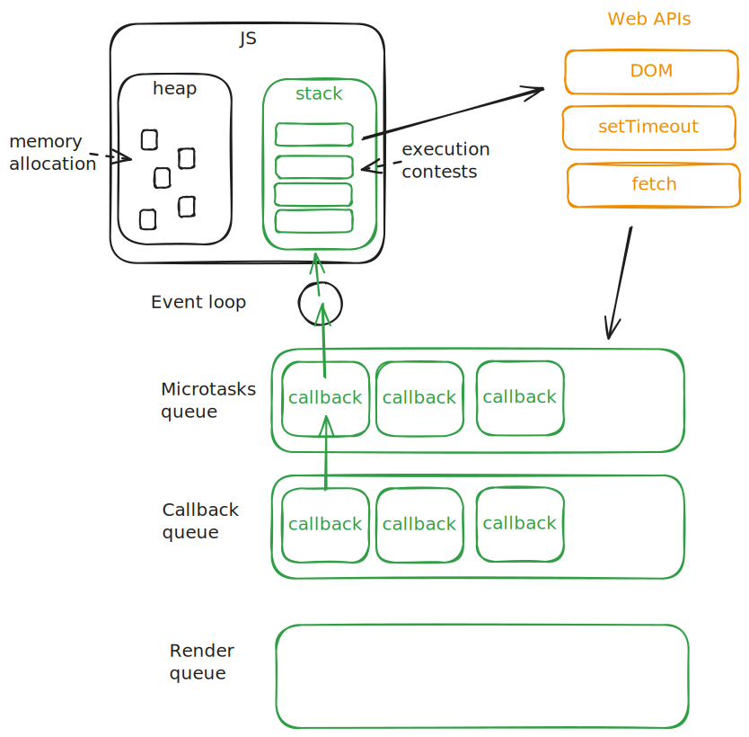
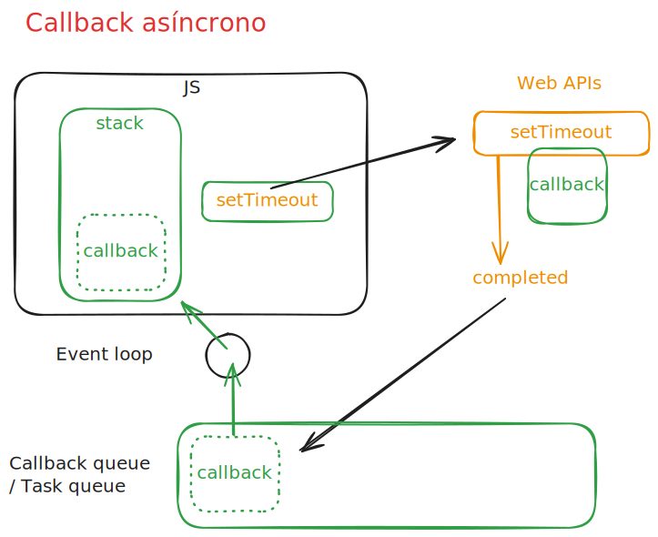
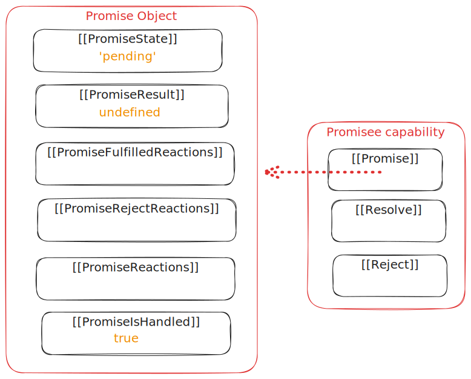
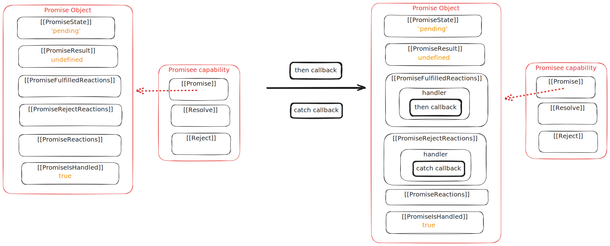

# JS asíncrono

- [JS asíncrono](#js-asíncrono)
  - [Multiplicidad de tareas](#multiplicidad-de-tareas)
    - [Paralelismo](#paralelismo)
    - [Concurrencia](#concurrencia)
    - [Concurrencia y código bloqueante](#concurrencia-y-código-bloqueante)
  - [Asincronía en JS](#asincronía-en-js)
    - [Asincronía, tiempo y ejecución en segundo plano](#asincronía-tiempo-y-ejecución-en-segundo-plano)
    - [Event Loop](#event-loop)
  - [Funciones callback asíncronas.](#funciones-callback-asíncronas)
    - [Timers](#timers)
    - [Otros ejemplos de funciones callback asíncronas](#otros-ejemplos-de-funciones-callback-asíncronas)
    - [Callback hell (infierno de los callbacks)](#callback-hell-infierno-de-los-callbacks)
  - [Promesas \[_🗓️ES2015_\]](#promesas-️es2015)
    - [Concepto y funcionalidad de las promesas](#concepto-y-funcionalidad-de-las-promesas)
    - [Funcionamiento interno de las promesas](#funcionamiento-interno-de-las-promesas)
    - [MicroTask queue](#microtask-queue)
    - [Promisificación](#promisificación)
    - [Encadenamiento de promesas](#encadenamiento-de-promesas)
    - [Métodos estáticos de la clase Promise](#métodos-estáticos-de-la-clase-promise)
  - [Async/await](#asyncawait)
    - [Async \[_🗓️ES2017_\]](#async-️es2017)
    - [Await \[_🗓️ES2017_\]](#await-️es2017)
    - [Top level await \[_🗓️ES2022_\]](#top-level-await-️es2022)
  - [Fetch. Rest APIs](#fetch-rest-apis)
    - [Peticiones http](#peticiones-http)
    - [Rest APIs](#rest-apis)

JS es un lenguaje **monoproceso concurrente** (single threaded single concurrent language), lo que significa que solo puede hacer una cosa a la vez.

> JavaScript is single threaded (one command executing at a time) and has a synchronous execution model (each line is executed in order the code appears)
> [JavaScript es mono-hilo (una instrucción se ejecuta a la vez) y tiene un modelo de ejecución síncrono (cada línea se ejecuta en el orden en que aparece el código)]

Sin embargo, gracias a una serie de elementos como

- pila de llamadas (call stack)
- bucle de eventos (event loop)
- cola de callbacks (callback queue)
- otras API proporcionadas por Node o el navegador

puede delegar tareas a otros procesos hacer que JS se comporte de manera **asíncrona**.

## Multiplicidad de tareas

La **multiplicidad de tareas** es la capacidad de un sistema para manejar múltiples tareas al mismo tiempo. Puede enfocarse desde la dos perspectivas:

- **paralelismo**.
- **concurrencia**, que es un concepto más amplio que el

### Paralelismo

- Se refiere a la ejecución simultánea de múltiples tareas
- Implica concurrencia
- Ejemplo: Un sistema con múltiples núcleos de procesamiento
- Ejemplo de la vida real: Un equipo de trabajo ruinoso: un camarero para cada cliente

### Concurrencia

- Es un concepto más amplio que el paralelismo (Para que un sistema sea paralelo, debe ser concurrente, pero no al revés.)
- Se refiere a la capacidad de un sistema para manejar múltiples tareas al mismo tiempo
- No necesariamente implica que las tareas se ejecuten al mismo tiempo
- Ejemplo: Un sistema operativo que maneja múltiples procesos
- ES (Javascript) es un lenguaje concurrente: solo puede hacer una cosa a la vez
- Es muy importante evitar bloquear el hilo principal de ejecución -> `event loop` y la asincronía
- Actualmente puede delegar tareas a otros procesos

La concurrencia va asociada a la distribución de tareas en el tiempo, mientras que el paralelismo va asociado a la distribución de tareas en el espacio.
Para el primer caso es importante la medida del tiempo en el sistema al que hacemos referencia. En los microprocesadores, la unidad de tiempo es el ciclo de reloj, que es el tiempo que tarda en ejecutarse una instrucción. Un procesador moderno trabaja a 3 GHz, lo que significa que puede ejecutar 3 mil millones (3_000_000_000) de instrucciones por segundo o tres millones de instrucciones por milisegundo. El tiempo de una instrucción es de 0.33 nanosegundos. Un milisegundo es 1_000_000 de nanosegundos, es decir toda una eternidad para un procesador moderno.

En un segundo el número de instrucciones que puede ejecutar un procesador moderno es de 3_000_000_000. En un milisegundo, el número de instrucciones que puede ejecutar es de 3_000_000. En un microsegundo, el número de instrucciones que puede ejecutar es de 3_000. En un nanosegundo, el número de instrucciones que puede ejecutar es de 3.

### Concurrencia y código bloqueante

La necesidad de llevar a cabo procesos que **consumen tiempo** de CPU, como la lectura de un archivo, la consulta a una base de datos o la petición a un servidor, hace que sea necesario recurrir a la concurrencia para evitar bloquear el hilo principal de ejecución.

Al no disponer de paralelismo, la única alternativa a la concurrencia es el código **bloqueante**: mientras se lleva a cabo la tarea que consume tiempo, el hilo de ejecución de JS queda bloqueado, sin poder llevar a cabo otras tareas.

Por tanto, el código bloqueante es aquel que **detiene la ejecución del programa** hasta que se cumple una condición. En un lenguaje asíncrono como JS, el código bloqueante puede ser un problema, ya que detiene la ejecución del programa y no permite que otras tareas se ejecuten.

```js
const wait = (secondsLimit) => {
  const SECOND_INSTRUCTIONS = 3_000_000_000 / 2; // 1.5Ghz
  limit = secondsLimit * SECOND_INSTRUCTIONS;
  let i = 0;
  while (i < limit) {
    i++;
  }
};

let seconds = 1;
const start = Date.now();
console.log('Inicio');
wait(seconds);
console.log('Por fin', (Date.now() - start) * 0.001, 'segundos después');
```

Al ser JS un lenguaje con un sólo hilo de ejecución, el código anterior bloquea la ejecución concurrente de cualquier otra tarea hasta que se cumpla la condición del bucle.

## Asincronía en JS

La **asincronía** en JS es la posibilidad de ejecutar tareas en segundo plano y continuar con la ejecución del programa sin esperar a que se completen. Como alternativa al código bloqueante tiene tres objetivos principales:

1. Ser capaz de realizar tareas que tardan mucho tiempo en completarse, por ejemplo, obtener datos del servidor.
2. Continuar ejecutando nuestro código JavaScript línea por línea sin que una tarea larga bloquee la ejecución de JavaScript.
3. Cuando nuestra tarea lenta se completa, deberíamos poder ejecutar funcionalidades sabiendo que la tarea está hecha y los datos están listos.

La asincronía en JS se logra mediante el uso de

- funciones de orden superior (callbacks)
- promesas
- async/await.

### Asincronía, tiempo y ejecución en segundo plano

Uno de los ejemplos más comunes de asincronía en JS es el uso de `setTimeout`, que permite ejecutar la función pasada como callback después de un cierto tiempo.

```js
console.log('Tarea 1');
setTimeout(() => console.log('Tarea 2'));
console.log('Tarea 3');
setTimeout(() => console.log('Tarea 4'), 1000);
console.log('Tarea 5');
console.log('Tarea 6');
setTimeout(() => console.log('Tarea 7'), 500);
setTimeout(() => console.log('Tarea 8'), 499);
console.log('Tarea 9');
console.log('Tarea 10');
```

En la consola veremos el siguiente resultado:

```shell
Tarea 1
Tarea 3
Tarea 5
Tarea 6
Tarea 9
Tarea 10
Tarea 11
Tarea 2 (inmediato)
Tarea 8 (499ms)
Tarea 7 (500ms)
Tarea 4 (1000ms)
```

Las tareas 8, 7 y 4 se ejecutan al cabo de 499, 500 y 1000 milisegundos respectivamente, por lo que aparecen en los tres últimos lugares.

Lo más interesante es la posición en que aparece la tarea 2, después de las tareas 1, 3, 5, 6, 9 y 10. Esto se debe a que `setTimeout` es una función asíncrona, por lo que la tarea 2 se ejecuta en segundo plano, a pasar de ser inmediata, sin ningún tiempo de espera.

La asincronía no es obligatoriamente una cuestión de tiempo, sino de **ejecución en segundo plano**.

Veamos otro ejemplo utilizando Promesas, además de `setTimeout`:

```js
console.log('Tarea 1');
setTimeout(() => console.log('Tarea 2'));
console.log('Tarea 3');
Promise.resolve().then(() => console.log('microTarea 4'));
console.log('Tarea 5');
setTimeout(() => console.log('Tarea 6'));
Promise.resolve().then(() => console.log('microTarea 7'));
console.log('Tarea 9');
console.log('Tarea 9');
console.log('Tarea 10');
```

En la consola veremos el siguiente resultado:

```shell
Tarea 1
Tarea 3
Tarea 5
Tarea 9
Tarea 9
Tarea 10
microTarea 4
microTarea 7
Tarea 2
Tarea 6
```

Todos los procesos asíncronos se ejecutan después de las tareas síncronas, al pasar a un segundo plano, pero no necesariamente en el orden en que se han declarado. Las microtareas creadas por las promesas se ejecutan antes que las tareas asíncronas correspondientes a setTimeout.

Podemos ver en vivo este proceso gracias al debugger de JS.

### Event Loop

La posibilidad de que exista asincronía en JS se debe a una serie de elementos de software que acompañan al motor de JS tanto en el navegador como en Node, entre los que se incluyen

- el **bucle de eventos** (event loop)
- las **APIs** del entorno (Web / Node)
- la **cola de callbacks** (callback queue)
- la **cola de microtareas** (microtask queue)

El propio motor de JS gestiona las sucesivas tareas síncronas, gracias a su **pila de llamadas** (call stack), en la que se apilan las tareas a medida que se van ejecutando.

Cuando una tarea asíncrona se ejecuta, suele intervenir alguna **API del entorno**, como `setTimeout`, que se encarga de gestionar la tarea asíncrona, esperando a que transcurra el tiempo indicado en el argumento de la función. Una vez que la tarea asíncrona se completa,

En **Node** suele hablarse de **Node background threads**, mientras que en el navegador se habla de **Web APIs**, aunque afortunadamente para los programadores, Node y los navegadores comparten algunas APIs críticas, como `setTimeout`, `setInterval`, `fetch`, `XMLHttpRequest` y `crypto`, vinculadas al comportamiento asíncrona del lenguaje.

Estas APIs son el mecanismo que tiene JS para comunicarse con una serie de elementos de software, generalmente escritos en C++, que se encargan de gestionar las tareas asíncronas. Desde el punto de vista de JS, emplean el patrón facade, proporcionando una interfaz sencilla para interactuar con el motor de JS, que oculta la complejidad de las tareas asíncronas. Realmente, ni siquiera existe un execution context para estas tareas, sino que se ejecutan en segundo plano, fuera del hilo principal de JS.

[Web APIs en MDN](https://developer.mozilla.org/es/docs/Web/API)

Por ejemplo, `setTimeout` es un código escrito en C++ que se ejecuta en segundo plano, fuera del hilo principal de JS, y que se comunica con el motor de JS a través de **callbacks**.

Cuando una tarea asíncrona se completa, el callback asociado a la tarea pasa a la **cola de callbacks** (callback queue), donde queda a la espera de ser gestionada por el bucle de eventos (event loop).

El **bucle de eventos** se encarga de comprobar

- si el **call stack** está vacío, es decir si no hay tareas pendientes de ejecución y el motor de JS está en espera
- si hay tareas en la cola de microtareas (microtask queue) y las ejecuta en el orden en que han llegado
- si hay tareas en la cola de callbacks y las ejecuta en el orden en que han llegado.



En este mecanismo de gestión de tareas asíncronas, estas pueden ser originadas de tres maneras principales:

- **Callbacks de funciones asíncronas**: funciones que se ejecutan después de que una tarea asíncrona se completa, por ejemplo, `setTimeout` o `XMLHttpRequest`
- **Promesas**: objetos que representan la finalización o el fracaso de una tarea asíncrona
- **Async/await**: palabras clave que permiten escribir código asíncrono basado en promesas de forma más sencilla y legible

En los dos primeros casos se utilizan funciones de orden superior que reciben callbacks como argumentos, pero hay que tener en cuenta que este patrón de programación funcional de JS no tiene que estar vinculado necesariamente a la asincronía. Por ejemplo los métodos de array de orden superior (foreach, map, filter, find, reduce...) utilizan callbacks que ejecutan de forma síncrona.

## Funciones callback asíncronas.

### Timers

En el caso de setTimeout, la función callback se ejecuta después de que haya transcurrido el tiempo indicado en el segundo argumento de la función.
El tiempo indicado sera el retraso hasta que la función callback se coloca en la cola de callbacks. A partir de ese momento, la función callback se ejecutará en cuanto el bucle de eventos lo permita por estar el call stack vacío. Esto puede ser inmediatamente si no hay tareas pendientes en el call stack, con lo que el retraso final coincidirá con el tiempo indicado en el segundo argumento de la función setTimeout. Si hay tareas pendientes en el call stack, la función callback se ejecutará en cuanto el call stack esté vacío.

Veamos un ejemplo que usa `setTimeout` para simular una tarea asíncrona:

```js
const makeAsync = (time, callback) => {
  return setTimeout(() => {
    const n = Math.random();
    callback(n);
  }, time);
};

const x = 22;
makeAsync(20, (value) => console.log(value * x));
```



En este caso, la función `makeAsync` recibe dos argumentos: el tiempo en milisegundos y una función callback. La función `makeAsync` devuelve el identificador del temporizador, que se puede utilizar para cancelar la tarea asíncrona con `clearTimeout`.

### Otros ejemplos de funciones callback asíncronas

Otro ejemplo de función callback asíncrona es `getLocation`, que se utiliza para obtener la ubicación del usuario. La función `getLocation` es asíncrona porque depende de la respuesta del usuario, que puede tardar un tiempo variable.

```js
const getLocation = (onSuccess, onError) => {
  navigator.geolocation.getCurrentPosition(
    onSuccess, //(position) => onSuccess(position),
    onError //(error) => onError(error)
  );
};
```

Por último, el uso de los callbacks asíncronos es clave a la hora de trabajar con **eventos del DOM**, como el evento `click` de un botón, registrando la **función manejadora** del evento (handler o listener).

```js
const button = document.querySelector('button');
button.addEventListener('click', (event) => {
  console.log('Botón pulsado');
});
```

### Callback hell (infierno de los callbacks)

El uso excesivo de funciones de orden superior que reciben callbacks como argumentos puede dar lugar a un código difícil de leer y mantener, conocido como **callback hell** o **infierno de los callbacks**.

```js
const makeAsync = (time, x, callback) => {
  return setTimeout(() => {
    const n = Math.trunc(Math.random() * 100);
    callback(x, n);
  }, time);
};

const initial = 2;
makeAsync(20, initial, (seed, random) => {
  const result = seed * random;
  console.log(result);
  makeAsyn(20, result, (seed, random) => {
    const result = seed * random;
    console.log(result);
    makeAsync(20, result, (seed, random) => {
      const result = seed * random;
      console.log(result);
      makeAsync(20, result, (seed, random) => {
        const result = seed * random;
        console.log(result);
        makeAsync(20, result, (seed, random) => {
          const result = seed * random;
          console.log(result);
        });
      });
    });
  });
});
```

En el resultado, cada numero depende del anterior y de un valor random entre 1 y 100, obtenido de forma asíncrona, que podría simular una operación I/O de disco o red. Por tanto, cada llamada a la función `makeAsync` depende de la respuesta de la llamada anterior, y tiene que estar anidada, lo que da lugar a un código difícil de leer y mantener.

```js
86;
2580;
196080;
13725600;
850987200;
```

## Promesas [_🗓️ES2015_]

### Concepto y funcionalidad de las promesas

Las promesas en JS son objetos que representan la finalización o el fracaso de una tarea asíncrona. Se utilizan para gestionar tareas asíncronas de forma más sencilla y legible, evitando el callback hell.

Al crear una promesa como instancia del constructor Promise, este recibe una función callback conocida como executor, con dos argumentos, `resolve` y `reject`. Estos son funciones proporcionadas por JS que se utilizan para resolver o rechazar la promesa.

```js
export const makeAsyncImmediate = () => {
  return new Promise((resolve, reject) => {
    const n = Math.random();
    if (n > 0.5) {
      resolve({ value: n });
    } else {
      reject(new Error(`Error ${n}`));
    }
  });
};
```

En el ejemplo anterior, la función `makeAsyncImmediate` devuelve una promesa que se resuelve si el número aleatorio es mayor que 0.5, y se rechaza en caso contrario. El resultado es inmediato, sin tiempo de espera, pero no por ello deja de ser asíncrono, como vimos que ocurría con `setTimeout` si el argumento para el retraso era 0.

Si queremos que la promesa se resuelva después de un cierto tiempo, podemos utilizar `setTimeout` dentro del executor.

```js
export const makeAsync = (time, data = null) => {
  return new Promise((resolve, reject) => {
    setTimeout(() => {
      const n = Math.random();
      if (n > 0.5) {
        resolve({
          value: n,
          previous: data,
        });
      } else {
        reject(new Error(`Error ${n}`));
      }
    }, time);
  });
};
```

Cuando llamamos a **resolve**, el estado de la promesa se establece en cumplido (`fulfilled`) y el resultado de la promesa se establece en el valor que pasamos a resolve, en este caso el objeto `{ value: n ...}`

Podemos rechazar la promesa llamando a **reject**, en cuyo caso el estado de la promesa se dice que se rechaza (`rejected`) y el resultado de la promesa se establece en el valor que pasamos a reject, en este caso el error `Error ${n}`.

En ambos casos solo estamos llamando a una función para cambiar alguna propiedad del objeto promise.

En cualquiera de los casos, podemos utilizar el método `then` para manejar la resolución de la promesa y el método `catch` para manejar el rechazo de la promesa.
Además, desde ES2018, existe un tercer método menos utilizado, el método `finally`, que se ejecuta siempre, tanto si la promesa se resuelve como si se rechaza.

Cuando la función `resolve` se utiliza para cambiar el estado de la promesa a "cumplida" (`fulfilled`) su valor puede ser utilizado por los manejadores de éxito (`.then`). Por otro lado, cuando la función `reject` cambia el estado de la promesa a "rechazada" (`rejected`) el n motivo de rechazo que puede ser manejado por los manejadores de error (`.catch`). Estas funciones permiten controlar el flujo de operaciones asíncronas y manejar tanto los resultados exitosos como los errores de manera estructurada.

```js
makeAsyncImmediate()
  .then((data) => console.log(data))
  .catch((error) => console.log(error.message))
  .finally(() => console.log('Proceso finalizado'));
```

Opcionalmente, el método `then` puede recibir dos argumentos, `onFulfilled` y `onRejected`, que son funciones callback que se ejecutan cuando la promesa se resuelve o se rechaza, respectivamente. Pero esta forma de manejar las promesas es menos legible y más propensa a errores, por lo que se recomienda utilizar `catch` para manejar el rechazo de la promesa.

```js
makeAsyncImmediate().then(
  (data) => console.log(data),
  (error) => console.log(error.message)
);
```

Además, el método `then` devuelve una nueva promesa, lo que permite encadenar promesas y manejar los errores de forma más sencilla, con un único método catch final.

```js
makeAsync(1000)
  .then((data) => {
    console.log(data);
    return makeAsync(1000, data);
  })
  .then((data) => console.log('Segunda promesa', data))
  .catch((error) => console.log(error.message))
  .finally((_) => console.log('Proceso finalizado'));
```

### Funcionamiento interno de las promesas

Cuando se ejecuta el constructor `new Promise`, se crea un nuevo objeto de promesa en la memoria. Este objeto de promesa contiene una serie de pseudo-propiedades conocidas como **internal slots** que gestionan el estado de la promesa (pendiente, cumplida o rechazada) y almacenan los valores asociados con estos estados. Estos espacios internos son cruciales para el funcionamiento de las promesas, ya que permiten rastrear y manejar el resultado de las operaciones asíncronas de manera eficiente.

- `promiseState`: estado de la promesa, que puede ser `pending`, `fulfilled` o `rejected`
- `promiseResult`: resultado de la promesa, que puede ser `undefined`, un valor o un error
- `promiseFulfillReactions`: lista de callbacks que se ejecutan cuando la promesa se resuelve
- `promiseRejectReactions`: lista de callbacks que se ejecutan cuando la promesa se rechaza
- `promiseReactions`: lista de callbacks que se ejecutan cuando la promesa se resuelve o se rechaza
- `promiseIsHandled`: indica si la promesa ha sido manejada por un callback

El slot `promiseState` se inicializa a `pending`, `promiseIsHandled` se inicializa a `false`
y los demás slots se completan más adelante.

Existen una serie de registros correspondientes a las reacciones de la promesa: `promiseFulfillReactions` almacena la lista de callbacks proporcionados en el método then de la promesa, mientras que `promiseRejectReactions` almacena la lista de callbacks proporcionados en el método catch y `promiseReactions` almacena la lista de callbacks proporcionados en el método finally.



Estos registros se crean cuando se encadenan los métodos `then`, `catch` o `finally` a la promesa. Por ejemplo, cada vez que encadenamos `then`, el método `then` es responsable de crear el registro `promiseFulfillReactions` y entre muchos otros campos, este registro contiene una capa handler y que corresponde al código que pasamos a `then`.



Cuando la promesa se resuelve o se rechaza, la función resolve o reject se ejecuta, y se añade a la call stack de JS. En la promesa

- se actualiza el **estado**: el slot `promiseState` pasa a `fulfilled` o `rejected`
- se actualiza el **resultado**: el slot `promiseResult` pasa a ser el valor o el error que se ha producido.
- En función del nuevo estado de la promesa, el **handler** del slot correspondiente, `promiseFulfillReactions` o `promiseRejectReactions` recibe como argumento el valor o el error que ha producido la resolución o el rechazo de la promesa. De esta forma se inicia el proceso de ejecución de los callbacks asociados a la promesa.

Sin embargo esta ejecución no se produce de forma inmediata, sino que el handler implicado se añade a la **cola de microtareas** (microtask queue) para ser ejecutadas por el **bucle de eventos** (event loop) en el orden en que han llegado.

El proceso es similar al que ocurre con la **cola de callbacks**, pero con la diferencia de que el bucle de eventos (event loop ) siempre prioriza las las microtareas y solo si la cola de microtareas está vacía pasa a procesar la cola de callbacks.

### MicroTask queue

Se utiliza la microTask queue para gestionar las siguientes microtareas:

- callbacks de promesas, registrados con `then`, `catch` o `finally`
- funciones precedidas por `await` dentro de las funciones asíncronas
- callbacks de `queueMicrotask` en el navegador
- callbacks de `MutationObserver`
- callbacks de `IntersectionObserver`
- callbacks de `process.nextTick` en Node

Las microtareas se ejecutan antes que las tareas asíncronas de la cola de callbacks. Antes de dar paso a una nueva tarea asíncrona, el bucle de eventos comprueba si hay microtareas pendientes en la microTask queue y las ejecuta en el orden en que han llegado.

### Promisificación

Las funciones basadas en callbacks se pueden convertir en funciones basadas en promesas gracias a la función `Promise.resolve` o `Promise.reject`.

```js
const wait = (fn, seconds) => {
  return new Promise((resolve, reject) => {
    setTimeout(() => {
      try {
        resolve(fn());
      } catch (error) {
        reject(error);
      }
    }, seconds * 1000);
  });
};
```

```js
const getLocation = () => {
  return new Promise((resolve, reject) => {
    navigator.geolocation.getCurrentPosition(
      resolve, // (position) => resolve(position),
      reject // (error) => reject(error)
    );
  });
};
```

### Encadenamiento de promesas

Cuando se encadenan promesas, el método `then` siempre devuelve una nueva promesa. Esta sera void si lo es el callback del then o contendrá el valor que devuelve el callback. De esta forma, se pueden encadenar promesas y manejar los errores de forma más sencilla, con un único método `catch`. Esta es una de las grandes ventajas de las promesas frente a los callbacks.

Usando callbacks tendíamos un ejemplo a pequeña escala del callback hell.

```js
getLocationName((locationName) => {
  getLocation(locationName, (location) => {
    getWeather(location, (weather) => {
      getForecast(weather, (forecast) => {
        console.log(forecast);
      });
    });
  });
});
```

Con promesas, el código es mucho más legible y mantenible.

```js
getLocationName()
  .then((locationName) => getLocation(locationName))
  .then((location) => getWeather(location))
  .then((weather) => getForecast(weather))
  .then((forecast) => console.log(forecast))
  .catch((error) => console.error(error.message))
  .finally(() => console.log('Proceso finalizado'));
```

El ejemplo anterior, se encadenan cuatro promesas, `getLocationName`, `getWeather`, `getForecast` y `console.log`, y se manejan los errores con un único `catch`, pero el código
puede incluso reescribirse de forma más concisa, dado que la firma de las funciones callback se ha vuelto más simple, dependiendo como único parámetro del resutado de la promesa.

```js
getLocationName()
  .then(getLocation)
  .then(gtWeather)
  .then(getForecast)
  .then(console.log)
  .catch((error) => console.error(error.message))
  .finally(() => console.log('Proceso finalizado'));
```

En el ejemplo anterior, se encadenan cuatro promesas, `getLocationName`, `getWeather`, `getForecast` y `console.log`, y se manejan los errores con un único

### Métodos estáticos de la clase Promise

La clase `Promise` proporciona una serie de métodos estáticos que permiten trabajar con promesas de forma más sencilla y legible, como

- `Promise.all`
- `Promise.race`
- `Promise.allSettled` [_🗓️ES2020_]
- `Promise.any` [_🗓️ES2021_]

El encadenamiento de las promesas solo tiene sentido cuando las promesas se resuelven de forma secuencial, es decir, cuando el resultado de una promesa depende del resultado de la promesa anterior. Por contra, los métodos estáticos de la clase `Promise` permiten trabajar con múltiples promesas de forma simultánea, y manejar los resultados de forma más sencilla.

- `Promise.all` recibe un array de promesas y devuelve una nueva promesa que se resuelve cuando todas las promesas del array se han resuelto, o se rechaza si alguna de las promesas se rechaza.
- `Promise.race` recibe un array de promesas y devuelve una nueva promesa que se resuelve o se rechaza en función de la primera promesa del array que se resuelve o se rechaza.
- `Promise.allSettled` recibe un array de promesas y devuelve una nueva promesa que se resuelve cuando todas las promesas del array se han resuelto o rechazado, independientemente de si alguna de las promesas se ha rechazado.
- `Promise.any` recibe un array de promesas y devuelve una nueva promesa que se resuelve cuando alguna de las promesas del array se ha resuelto, o se rechaza si todas las promesas se han rechazado.

```js
const promises = [
  makeAsync(1000),
  makeAsync(2000),
  makeAsync(3000),
  makeAsync(4000),
];

Promise.all(promises)
  .then((results) => console.log(results))
  .catch((error) => console.error(error.message));
```

En el ejemplo anterior, se ejecutan en paralelo cuatro promesas, `makeAsync(1000)`, `makeAsync(2000)`, `makeAsync(3000)` y `makeAsync(4000)`, y se si cualquiera de ellas falla se recibe el error con un único `catch`. Si todas las promesas se resuelven, se recibe un array con los resultados de las promesas.

## Async/await

### Async [_🗓️ES2017_]

La palabra reservada async se utiliza para declarar una función asíncrona, que devuelve una promesa. El return definido en la función se convierte en el valor resuelto de la promesa, mientras que cualquier excepción lanzada se convierte en el valor rechazado de la promesa.

```js
const makeAsyncImmediate = async () => {
  const n = Math.random();
  if (n < 0.5) {
    throw new Error(`Error ${n}`);
  }

  return { value: n };
};
```

En el ejemplo vemos otra forma de implementar la función `makeAsyncImmediate` como función asíncrona, que devuelve una promesa que se resuelve si el número aleatorio es mayor que 0.5, y se rechaza en caso contrario.

### Await [_🗓️ES2017_]

Dentro de una función asíncrona, se pueden utilizar las palabras reservadas await y return para manejar las promesas de forma más sencilla y legible.

```js
const makeAsync = async (time, data = null) => {
  await new Promise((resolve) => setTimeout(resolve, time));
  const n = Math.random();
  if (n < 0.5) {
    throw new Error(`Error ${n}`);
  }

  return {
    value: n,
    previous: data,
  };
};
```

En el ejemplo vemos otra forma de implementar la función `makeAsync` como función asíncrona, que devuelve una promesa que se resuelve después de un cierto tiempo, y se rechaza si el número aleatorio es menor que 0.5.

El uso de `await` permite gestionar cualquier función que devuelvas una promesa con un aspecto muy similar al código síncrono, lo que facilita la lectura y el mantenimiento del código. Inicialmente el problema era la necesidad de tener una función asíncrona para poder usar `await`, lo que podía solucionarse convirtiendo el código principal en una IIFFE (Immediately Invoked Function Expression), y aplicándole la palabra reservada async.

```js
(async () => {
  const result = await makeAsync(1000);
  console.log(result);
})();
```

### Top level await [_🗓️ES2022_]

Actualmente se puede utilizar `await` en cualquier punto del código, no solo dentro de una función asíncrona, gracias a la nueva característica de ECMAScript conocida como top level await.

```js
const result = await makeAsync(1000);
console.log(result);
```

Un top level await puede traer algunos problemas, por ejemplo, si se utiliza en un script de tipo módulo, ya que el módulo se convierte en una función asíncrona, lo que puede afectar a la carga de la página.

Además novedoso de esta característica puede llevar a problemas de compatibilidad con navegadores antiguos, o con entornos de testing como Jest, por lo que es recomendable utilizarla con precaución.

## Fetch. Rest APIs

Fetch es una API disponible en el navegador y recientemente en Node, diseñada para realizar **peticiones HTTP** en JS, que se basa en promesas y permite realizar peticiones asíncronas de forma sencilla y legible.

Como mos en `setTimeout`, utiliza el patrón facade, proporcionando una interfaz sencilla para interactuar con el motor de JS, pero en este caso con una implementación en dos vias

- la primera de ellas, ajena a JS, es capaz de gestionar las **peticiones http** (XMLHttpRequest o xhr), interaccionar con la tecnología de red y recibir la respuesta por parte del servidor.
- la segunda vía, a nivel de JS, implica la creación de un **objeto de tipo promesa**, en el mismo momento en que se invoca fetch, sin que ello implique un contexto de ejecución para la función fetch.

```js
fetch('https://jsonplaceholder.typicode.com/posts/1');
```

### Peticiones http

El protocolo http es un protocolo de comunicación muy sencillo que permite la transferencia de información en la web. Se basa en el modelo cliente-servidor, en el que el cliente envía una petición al servidor y este responde con una respuesta.

La petición http consta de una línea de petición, una cabecera y un cuerpo.

- En la línea de petición se especifica el **método http**, la **url** y la versión del protocolo.
- En la cabecera se especifican los **metadatos** de la petición, como el tipo de contenido, la longitud del cuerpo o las cookies.
- El cuerpo contiene los datos de la petición, como los parámetros de un formulario.

La respuesta http consta de una línea de estado, una cabecera y un cuerpo.

El navegador incluye entre sus funcionalidades la posibilidad de realizar peticiones http, en respuesta al método fetch de JS, conocidas como xhr o XMLHttpRequest, por el formato con el que fueron creadas inicialmente.

Cuando el navegador recibe una petición http, la envía al servidor y espera la respuesta. Una vez que recibe la respuesta, la procesa y la devuelve a JS, que la recibe como un objeto de tipo **Response**. En este punto, la promesa creada por fetch se resuelve o se rechaza, en función de si la petición se ha completado con éxito o ha fallado.

Técnicamente, esto significa que cambia el estado de la promesa (`promiseState`) de pending a fulfilled o rejected. En función del nuevo estado de la promesa, se actualiza la propiedad `promiseResult` con la respuesta o el error, y se ejecutan los callbacks correspondientes, almacenados como `promiseFulfillReactions`, `promiseRejectReactions` y `promiseReactions` .

El objeto Response tiene una serie de métodos que permiten acceder a la respuesta, como `json`, `text`, `blob`, `arrayBuffer` o `formData`.

```js
fetch('https://jsonplaceholder.typicode.com/posts/1')
  .then((response) => response.json())
  .then((data) => console.log(data))
  .catch((error) => console.log(error));
```

Como se ve en el ejemplo, el primer then se encarga de convertir la respuesta en un objeto JSON, mientras que el segundo then se encarga de mostrar los datos en la consola. El catch se encarga de mostrar el error en caso de que la petición falle.

### Rest APIs

Las **APIs REST** (Representational State Transfer) son un conjunto de reglas y convenciones que definen cómo se deben comunicar los sistemas en la web.
Dentro de la arquitectura cliente-servidor, se emplea el protocolo http para que el cliente envía una petición al servidor y este responda con una respuesta. En la petición, se utilizan los métodos http para definir las operaciones CRUD (Create, Read, Update, Delete) sobre los recursos.

- **GET**: se utiliza para obtener información de un recurso.
- **POST**: se utiliza para crear un nuevo recurso.
- **PUT**: se utiliza para actualizar un recurso.
- **PATCH**: se utiliza para actualizar parcialmente un recurso.
- **DELETE**: se utiliza para eliminar un recurso.

El servidor responde a la petición con la operación solicitada sobre los datos.
La petición y la respuesta se envían en formato JSON, que es un formato de intercambio de datos ligero y fácil de leer.
